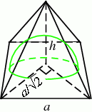

<h1 style='text-align: center;'> E. Dome</h1>

<h5 style='text-align: center;'>time limit per test: 1 second</h5>
<h5 style='text-align: center;'>memory limit per test: 256 megabytes</h5>

  ## Input

The input contains a single floating-point number *x* with exactly 6 decimal places (0 < *x* < 5).

## Output

## Output

 two integers separated by a single space. Each integer should be between 1 and 10, inclusive. If several solutions exist, output any of them. Solution will exist for all tests.

## Examples

## Input


```
1.200000  

```
## Output


```
3 2  

```
## Input


```
2.572479  

```
## Output


```
10 3  

```
## Input


```
4.024922  

```
## Output


```
9 9  

```


#### tags 

#1800 #*special 