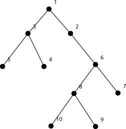
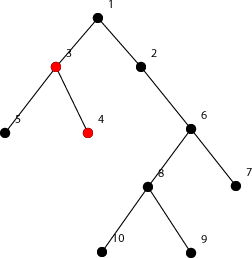
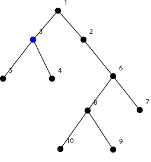
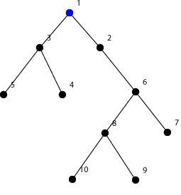

<h1 style='text-align: center;'> D. Mashmokh and Water Tanks</h1>

<h5 style='text-align: center;'>time limit per test: 1 second</h5>
<h5 style='text-align: center;'>memory limit per test: 512 megabytes</h5>

Mashmokh is playing a new game. In the beginning he has *k* liters of water and *p* coins. Additionally he has a rooted tree (an undirected connected acyclic graph) that consists of *m* vertices. Each vertex of the tree contains a water tank that is empty in the beginning.

The game begins with the fact that Mashmokh chooses some (no more than *k*) of these tanks (except the root) and pours into each of them exactly 1 liter of water. Then the following process is performed until there is no water remained in tanks.

* The process consists of several steps.
* At the beginning of each step Mashmokh opens doors of all tanks. Then Mashmokh closes doors of some tanks (he is not allowed to close door of tank in the root) for the duration of this move. Let's denote the number of liters in some tank with closed door as *w*, Mashmokh pays *w* coins for the closing of that tank during this move.
* Let's denote by *x*1, *x*2, ..., *x**m* as the list of vertices of the tree sorted (nondecreasing) by their depth. The vertices from this list should be considered one by one in the order. Firstly vertex *x*1 (which is the root itself) is emptied. Then for each vertex *x**i* (*i* > 1), if its door is closed then skip the vertex else move all the water from the tank of vertex *x**i* to the tank of its father (even if the tank of the father is closed).

Suppose *l* moves were made until the tree became empty. Let's denote the amount of water inside the tank of the root after the *i*-th move by *w**i* then Mashmokh will win *max*(*w*1, *w*2, ..., *w**l*) dollars. Mashmokh wanted to know what is the maximum amount of dollars he can win by playing the above game. He asked you to find this value for him.

## Input

The first line of the input contains three space-separated integers *m*, *k*, *p* (2 ≤ *m* ≤ 105; 0 ≤ *k*, *p* ≤ 109). 

Each of the following *m* - 1 lines contains two space-separated integers *a**i*, *b**i* (1 ≤ *a**i*, *b**i* ≤ *m*; *a**i* ≠ *b**i*) — the edges of the tree.

Consider that the vertices of the tree are numbered from 1 to *m*. The root of the tree has number 1.

## Output

## Output

 a single integer, the number Mashmokh asked you to find.

## Examples

## Input


```
10 2 1  
1 2  
1 3  
3 4  
3 5  
2 6  
6 8  
6 7  
9 8  
8 10  

```
## Output


```
2  

```
## Input


```
5 1000 1000  
1 2  
1 3  
3 4  
3 5  

```
## Output


```
4  

```
## Note

The tree in the first sample is shown on the picture below. The black, red, blue colors correspond to vertices with 0, 1, 2 liters of water.

One way to achieve the maximum amount of money is to put 1 liter of water in each of vertices 3 and 4. The beginning state is shown on the picture below.

Then in the first move Mashmokh will pay one token to close the door of the third vertex tank. The tree after the first move is shown on the picture below.

After the second move there are 2 liters of water in the root as shown on the picture below.



#### tags 

#2300 #binary_search #data_structures #greedy #trees #two_pointers 