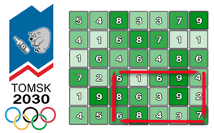

<h1 style='text-align: center;'> D. Biathlon Track</h1>

<h5 style='text-align: center;'>time limit per test: 4.5 seconds</h5>
<h5 style='text-align: center;'>memory limit per test: 256 megabytes</h5>

Recently an official statement of the world Olympic Committee said that the Olympic Winter Games 2030 will be held in Tomsk. The city officials decided to prepare for the Olympics thoroughly and to build all the necessary Olympic facilities as early as possible. First, a biathlon track will be built.

To construct a biathlon track a plot of land was allocated, which is a rectangle divided into *n* × *m* identical squares. Each of the squares has two coordinates: the number of the row (from 1 to *n*), where it is located, the number of the column (from 1 to *m*), where it is located. Also each of the squares is characterized by its height. During the sports the biathletes will have to move from one square to another. If a biathlete moves from a higher square to a lower one, he makes a descent. If a biathlete moves from a lower square to a higher one, he makes an ascent. If a biathlete moves between two squares with the same height, then he moves on flat ground.

The biathlon track should be a border of some rectangular area of the allocated land on which biathletes will move in the clockwise direction. It is known that on one move on flat ground an average biathlete spends *t**p* seconds, an ascent takes *t**u* seconds, a descent takes *t**d* seconds. The Tomsk Administration wants to choose the route so that the average biathlete passes it in as close to *t* seconds as possible. In other words, the difference between time *t**s* of passing the selected track and *t* should be minimum.

For a better understanding you can look at the first sample of the input data. In this sample *n* = 6, *m* = 7, and the administration wants the track covering time to be as close to *t* = 48 seconds as possible, also, *t**p* = 3, *t**u* = 6 and *t**d* = 2. If we consider the rectangle shown on the image by arrows, the average biathlete can move along the boundary in a clockwise direction in exactly 48 seconds. The upper left corner of this track is located in the square with the row number 4, column number 3 and the lower right corner is at square with row number 6, column number 7.

  Among other things the administration wants all sides of the rectangle which boundaries will be the biathlon track to consist of no less than three squares and to be completely contained within the selected land.

You are given the description of the given plot of land and all necessary time values. You are to write the program to find the most suitable rectangle for a biathlon track. If there are several such rectangles, you are allowed to print any of them.

## Input

The first line of the input contains three integers *n*, *m* and *t* (3 ≤ *n*, *m* ≤ 300, 1 ≤ *t* ≤ 109) — the sizes of the land plot and the desired distance covering time.

The second line also contains three integers *t**p*, *t**u* and *t**d* (1 ≤ *t**p*, *t**u*, *t**d* ≤ 100) — the time the average biathlete needs to cover a flat piece of the track, an ascent and a descent respectively.

Then *n* lines follow, each line contains *m* integers that set the heights of each square of the given plot of land. Each of the height values is a positive integer, not exceeding 106.

## Output

In a single line of the output print four positive integers — the number of the row and the number of the column of the upper left corner and the number of the row and the number of the column of the lower right corner of the rectangle that is chosen for the track.

## Examples

## Input


```
6 7 48  
3 6 2  
5 4 8 3 3 7 9  
4 1 6 8 7 1 1  
1 6 4 6 4 8 6  
7 2 6 1 6 9 4  
1 9 8 6 3 9 2  
4 5 6 8 4 3 7
```
## Output


```
4 3 6 7  

```


#### tags 

#2300 #binary_search #brute_force #constructive_algorithms #data_structures #dp 