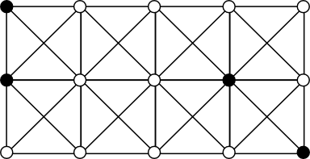
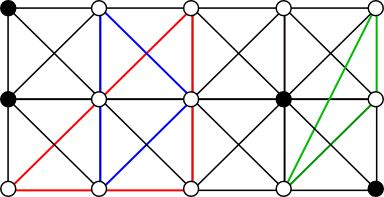

<h1 style='text-align: center;'> D. Special Grid</h1>

<h5 style='text-align: center;'>time limit per test: 4 seconds</h5>
<h5 style='text-align: center;'>memory limit per test: 256 megabytes</h5>

You are given an *n* × *m* grid, some of its nodes are black, the others are white. Moreover, it's not an ordinary grid — each unit square of the grid has painted diagonals.

The figure below is an example of such grid of size 3 × 5. Four nodes of this grid are black, the other 11 nodes are white.

  Your task is to count the number of such triangles on the given grid that:

* the corners match the white nodes, and the area is positive;
* all sides go along the grid lines (horizontal, vertical or diagonal);
* no side contains black nodes.
## Input

The first line contains two integers *n* and *m* (2 ≤ *n*, *m* ≤ 400). Each of the following *n* lines contain *m* characters (zeros and ones) — the description of the grid. If the *j*-th character in the *i*-th line equals zero, then the node on the *i*-th horizontal line and on the *j*-th vertical line is painted white. Otherwise, the node is painted black.

The horizontal lines are numbered starting from one from top to bottom, the vertical lines are numbered starting from one from left to right. 

## Output

Print a single integer — the number of required triangles.

## Examples

## Input


```
3 5  
10000  
10010  
00001  

```
## Output


```
20  

```
## Input


```
2 2  
00  
00  

```
## Output


```
4  

```
## Input


```
2 2  
11  
11  

```
## Output


```
0  

```
## Note

The figure below shows red and blue triangles. They are the examples of the required triangles in the first sample. One of the invalid triangles is painted green. It is invalid because not all sides go along the grid lines.

  

#### tags 

#2000 #brute_force #dp #greedy 