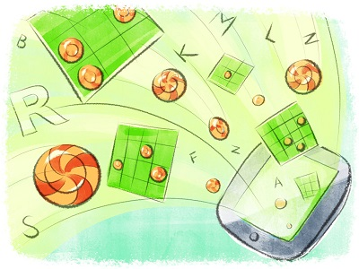

<h1 style='text-align: center;'> C. Dungeons and Candies</h1>

<h5 style='text-align: center;'>time limit per test: 2 seconds</h5>
<h5 style='text-align: center;'>memory limit per test: 256 megabytes</h5>

During the loading of the game "Dungeons and Candies" you are required to get descriptions of *k* levels from the server. Each description is a map of an *n* × *m* checkered rectangular field. Some cells of the field contain candies (each cell has at most one candy). An empty cell is denoted as "." on the map, but if a cell has a candy, it is denoted as a letter of the English alphabet. A level may contain identical candies, in this case the letters in the corresponding cells of the map will be the same.

  When you transmit information via a network, you want to minimize traffic — the total size of the transferred data. The levels can be transmitted in any order. There are two ways to transmit the current level *A*:

1. You can transmit the whole level *A*. Then you need to transmit *n*·*m* bytes via the network.
2. You can transmit the difference between level *A* and some previously transmitted level *B* (if it exists); this operation requires to transmit *d**A*, *B*·*w* bytes, where *d**A*, *B* is the number of cells of the field that are different for *A* and *B*, and *w* is a constant. Note, that you should compare only the corresponding cells of levels *A* and *B* to calculate *d**A*, *B*. You cannot transform the maps of levels, i.e. rotate or shift them relatively to each other.

Your task is to find a way to transfer all the *k* levels and minimize the traffic.

## Input

The first line contains four integers *n*, *m*, *k*, *w* (1 ≤ *n*, *m* ≤ 10; 1 ≤ *k*, *w* ≤ 1000). Then follows the description of *k* levels. Each level is described by *n* lines, each line contains *m* characters. Each character is either a letter of the English alphabet or a dot ("."). Please note that the case of the letters matters.

## Output

In the first line print the required minimum number of transferred bytes.

Then print *k* pairs of integers *x*1, *y*1, *x*2, *y*2, ..., *x**k*, *y**k*, describing the way to transfer levels. Pair *x**i*, *y**i* means that level *x**i* needs to be transferred by way *y**i*. If *y**i* equals 0, that means that the level must be transferred using the first way, otherwise *y**i* must be equal to the number of a previously transferred level. It means that you will transfer the difference between levels *y**i* and *x**i* to transfer level *x**i*. Print the pairs in the order of transferring levels. The levels are numbered 1 through *k* in the order they follow in the input.

If there are multiple optimal solutions, you can print any of them.

## Examples

## Input


```
2 3 3 2  
A.A  
...  
A.a  
..C  
X.Y  
...  

```
## Output


```
14  
1 0  
2 1  
3 1  

```
## Input


```
1 1 4 1  
A  
.  
B  
.  

```
## Output


```
3  
1 0  
2 0  
4 2  
3 0  

```
## Input


```
1 3 5 2  
ABA  
BBB  
BBA  
BAB  
ABB  

```
## Output


```
11  
1 0  
3 1  
2 3  
4 2  
5 1  

```


#### tags 

#1800 #dsu #graphs #greedy #trees 