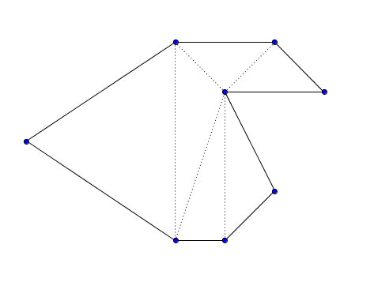
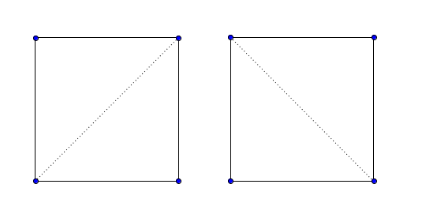
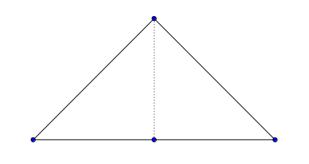

<h1 style='text-align: center;'> E. The Child and Polygon</h1>

<h5 style='text-align: center;'>time limit per test: 2 seconds</h5>
<h5 style='text-align: center;'>memory limit per test: 256 megabytes</h5>

This time our child has a simple polygon. He has to find the number of ways to split the polygon into non-degenerate triangles, each way must satisfy the following requirements:

* each vertex of each triangle is one of the polygon vertex;
* each side of the polygon must be the side of exactly one triangle;
* the area of intersection of every two triangles equals to zero, and the sum of all areas of triangles equals to the area of the polygon;
* each triangle must be completely inside the polygon;
* each side of each triangle must contain exactly two vertices of the polygon.

The picture below depicts an example of a correct splitting.

  Please, help the child. Calculate the described number of ways modulo 1000000007 (109  +  7) for him.

## Input

The first line contains one integer *n* (3 ≤ *n* ≤ 200) — the number of vertices of the polygon. Then follow *n* lines, each line containing two integers. The *i*-th line contains *x**i*, *y**i* (|*x**i*|, |*y**i*| ≤ 107) — the *i*-th vertex of the polygon in clockwise or counterclockwise order.

It's guaranteed that the polygon is simple.

## Output

## Output

 the number of ways modulo 1000000007 (109  +  7).

## Examples

## Input


```
4  
0 0  
0 1  
1 1  
1 0  

```
## Output


```
2  

```
## Input


```
4  
0 0  
1 0  
0 1  
-1 0  

```
## Output


```
1  

```
## Input


```
5  
0 0  
1 0  
1 1  
0 1  
-2 -1  

```
## Output


```
3  

```
## Note

In the first sample, there are two possible splittings:

  In the second sample, there are only one possible splitting:

  

#### tags 

#2500 #dp #geometry 