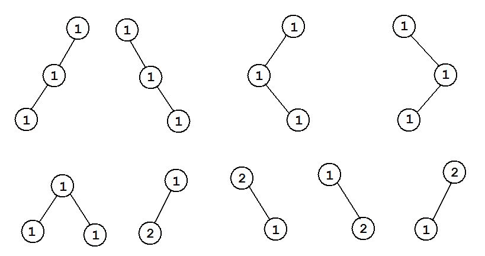

<h1 style='text-align: center;'> E. The Child and Binary Tree</h1>

<h5 style='text-align: center;'>time limit per test: 7 seconds</h5>
<h5 style='text-align: center;'>memory limit per test: 256 megabytes</h5>

Our child likes computer science very much, especially he likes binary trees.

Consider the sequence of *n* distinct positive integers: *c*1, *c*2, ..., *c**n*. The child calls a vertex-weighted rooted binary tree good if and only if for every vertex *v*, the weight of *v* is in the set {*c*1, *c*2, ..., *c**n*}. Also our child thinks that the weight of a vertex-weighted tree is the sum of all vertices' weights.

Given an integer *m*, can you for all *s* (1 ≤ *s* ≤ *m*) calculate the number of good vertex-weighted rooted binary trees with weight *s*? Please, check the samples for better understanding what trees are considered different.

We only want to know the answer modulo 998244353 (7 × 17 × 223 + 1, a prime number).

## Input

The first line contains two integers *n*, *m* (1 ≤ *n* ≤ 105; 1 ≤ *m* ≤ 105). The second line contains *n* space-separated pairwise distinct integers *c*1, *c*2, ..., *c**n*. (1 ≤ *c**i* ≤ 105).

## Output

Print *m* lines, each line containing a single integer. The *i*-th line must contain the number of good vertex-weighted rooted binary trees whose weight exactly equal to *i*. Print the answers modulo 998244353 (7 × 17 × 223 + 1, a prime number).

## Examples

## Input


```
2 3  
1 2  

```
## Output


```
1  
3  
9  

```
## Input


```
3 10  
9 4 3  

```
## Output


```
0  
0  
1  
1  
0  
2  
4  
2  
6  
15  

```
## Input


```
5 10  
13 10 6 4 15  

```
## Output


```
0  
0  
0  
1  
0  
1  
0  
2  
0  
5  

```
## Note

In the first example, there are 9 good vertex-weighted rooted binary trees whose weight exactly equal to 3:

  

#### tags 

#3100 #combinatorics #divide_and_conquer #fft #number_theory 