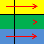
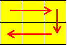

<h1 style='text-align: center;'> C. Valera and Tubes </h1>

<h5 style='text-align: center;'>time limit per test: 1 second</h5>
<h5 style='text-align: center;'>memory limit per test: 256 megabytes</h5>

Valera has got a rectangle table consisting of *n* rows and *m* columns. Valera numbered the table rows starting from one, from top to bottom and the columns – starting from one, from left to right. We will represent cell that is on the intersection of row *x* and column *y* by a pair of integers (*x*, *y*).

Valera wants to place exactly *k* tubes on his rectangle table. A tube is such sequence of table cells (*x*1, *y*1), (*x*2, *y*2), ..., (*x**r*, *y**r*), that: 

* *r* ≥ 2;
* for any integer *i* (1 ≤ *i* ≤ *r* - 1) the following equation |*x**i* - *x**i* + 1| + |*y**i* - *y**i* + 1| = 1 holds;
* each table cell, which belongs to the tube, must occur exactly once in the sequence.

Valera thinks that the tubes are arranged in a fancy manner if the following conditions are fulfilled: 

* no pair of tubes has common cells;
* each cell of the table belongs to some tube.

Help Valera to arrange *k* tubes on his rectangle table in a fancy manner.

## Input

The first line contains three space-separated integers *n*, *m*, *k* (2 ≤ *n*, *m* ≤ 300; 2 ≤ 2*k* ≤ *n*·*m*) — the number of rows, the number of columns and the number of tubes, correspondingly. 

## Output

Print *k* lines. In the *i*-th line print the description of the *i*-th tube: first print integer *r**i* (the number of tube cells), then print 2*r**i* integers *x**i*1, *y**i*1, *x**i*2, *y**i*2, ..., *x**ir**i*, *y**ir**i* (the sequence of table cells).

If there are multiple solutions, you can print any of them. It is guaranteed that at least one solution exists. 

## Examples

## Input


```
3 3 3  

```
## Output


```
3 1 1 1 2 1 3  
3 2 1 2 2 2 3  
3 3 1 3 2 3 3  

```
## Input


```
2 3 1  

```
## Output


```
6 1 1 1 2 1 3 2 3 2 2 2 1  

```
## Note

Picture for the first sample: 

  Picture for the second sample: 

  

#### tags 

#1500 #constructive_algorithms #dfs_and_similar #implementation 