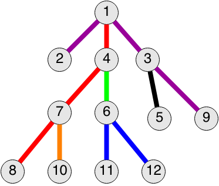

<h1 style='text-align: center;'> D. Adam and Tree</h1>

<h5 style='text-align: center;'>time limit per test: 2 seconds</h5>
<h5 style='text-align: center;'>memory limit per test: 256 megabytes</h5>

When Adam gets a rooted tree (connected non-directed graph without cycles), he immediately starts coloring it. More formally, he assigns a color to each edge of the tree so that it meets the following two conditions: 

* There is no vertex that has more than two incident edges painted the same color.
* For any two vertexes that have incident edges painted the same color (say, *c*), the path between them consists of the edges of the color *c*.

Not all tree paintings are equally good for Adam. Let's consider the path from some vertex to the root. Let's call the number of distinct colors on this path the cost of the vertex. The cost of the tree's coloring will be the maximum cost among all the vertexes. Help Adam determine the minimum possible cost of painting the tree. 

Initially, Adam's tree consists of a single vertex that has number one and is the root. In one move Adam adds a new vertex to the already existing one, the new vertex gets the number equal to the minimum positive available integer. After each operation you need to calculate the minimum cost of coloring the resulting tree.

## Input

The first line contains integer *n* (1 ≤ *n* ≤ 106) — the number of times a new vertex is added. The second line contains *n* numbers *p**i* (1 ≤ *p**i* ≤ *i*) — the numbers of the vertexes to which we add another vertex. 

## Output

Print *n* integers — the minimum costs of the tree painting after each addition. 

## Examples

## Input


```
11  
1 1 1 3 4 4 7 3 7 6 6  

```
## Output


```
1 1 1 1 1 2 2 2 2 2 3 
```
## Note

The figure below shows one of the possible variants to paint a tree from the sample at the last moment. The cost of the vertexes with numbers 11 and 12 equals 3.




#### tags 

#2600 #data_structures #trees 