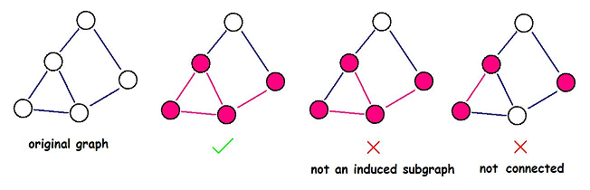

<h1 style='text-align: center;'> A. DZY Loves Physics</h1>

<h5 style='text-align: center;'>time limit per test: 1 second</h5>
<h5 style='text-align: center;'>memory limit per test: 256 megabytes</h5>

DZY loves Physics, and he enjoys calculating density.

Almost everything has density, even a graph. We define the density of a non-directed graph (nodes and edges of the graph have some values) as follows: 

 where *v* is the sum of the values of the nodes, *e* is the sum of the values of the edges.Once DZY got a graph *G*, now he wants to find a connected induced subgraph *G*' of the graph, such that the density of *G*' is as large as possible.

An induced subgraph *G*'(*V*', *E*') of a graph *G*(*V*, *E*) is a graph that satisfies:

* ;
* edge  if and only if , and edge ;
* the value of an edge in *G*' is the same as the value of the corresponding edge in *G*, so as the value of a node.

Help DZY to find the induced subgraph with maximum density. ## Note

 that the induced subgraph you choose must be connected.

  ## Input

The first line contains two space-separated integers *n* (1 ≤ *n* ≤ 500), . Integer *n* represents the number of nodes of the graph *G*, *m* represents the number of edges.

The second line contains *n* space-separated integers *x**i* (1 ≤ *x**i* ≤ 106), where *x**i* represents the value of the *i*-th node. Consider the graph nodes are numbered from 1 to *n*.

Each of the next *m* lines contains three space-separated integers *a**i*, *b**i*, *c**i* (1 ≤ *a**i* < *b**i* ≤ *n*; 1 ≤ *c**i* ≤ 103), denoting an edge between node *a**i* and *b**i* with value *c**i*. The graph won't contain multiple edges.

## Output

## Output

 a real number denoting the answer, with an absolute or relative error of at most 10- 9.

## Examples

## Input


```
1 0  
1  

```
## Output


```
0.000000000000000  

```
## Input


```
2 1  
1 2  
1 2 1  

```
## Output


```
3.000000000000000  

```
## Input


```
5 6  
13 56 73 98 17  
1 2 56  
1 3 29  
1 4 42  
2 3 95  
2 4 88  
3 4 63  

```
## Output


```
2.965517241379311  

```
## Note

In the first sample, you can only choose an empty subgraph, or the subgraph containing only node 1.

In the second sample, choosing the whole graph is optimal.


#### tags 

#1600 #greedy #math 