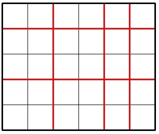
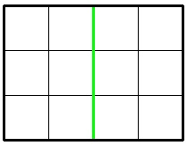
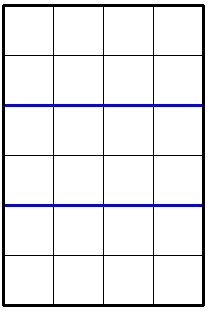

<h1 style='text-align: center;'> A. Jzzhu and Chocolate</h1>

<h5 style='text-align: center;'>time limit per test: 1 second</h5>
<h5 style='text-align: center;'>memory limit per test: 256 megabytes</h5>

Jzzhu has a big rectangular chocolate bar that consists of *n* × *m* unit squares. He wants to cut this bar exactly *k* times. Each cut must meet the following requirements:

* each cut should be straight (horizontal or vertical);
* each cut should go along edges of unit squares (it is prohibited to divide any unit chocolate square with cut);
* each cut should go inside the whole chocolate bar, and all cuts must be distinct.

The picture below shows a possible way to cut a 5 × 6 chocolate for 5 times.

  Imagine Jzzhu have made *k* cuts and the big chocolate is splitted into several pieces. Consider the smallest (by area) piece of the chocolate, Jzzhu wants this piece to be as large as possible. What is the maximum possible area of smallest piece he can get with exactly *k* cuts? The area of a chocolate piece is the number of unit squares in it.

## Input

A single line contains three integers *n*, *m*, *k* (1 ≤ *n*, *m* ≤ 109; 1 ≤ *k* ≤ 2·109).

## Output

## Output

 a single integer representing the answer. If it is impossible to cut the big chocolate *k* times, print -1.

## Examples

## Input


```
3 4 1  

```
## Output


```
6  

```
## Input


```
6 4 2  

```
## Output


```
8  

```
## Input


```
2 3 4  

```
## Output


```
-1  

```
## Note

In the first sample, Jzzhu can cut the chocolate following the picture below:

  In the second sample the optimal division looks like this:

  In the third sample, it's impossible to cut a 2 × 3 chocolate 4 times.


#### tags 

#1700 #greedy #math 