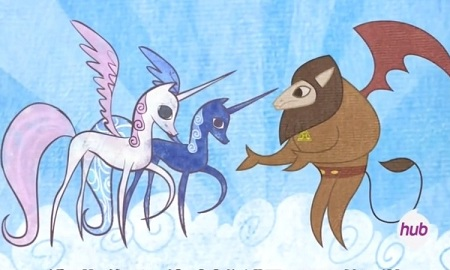

<h1 style='text-align: center;'> E. Little Pony and Lord Tirek</h1>

<h5 style='text-align: center;'>time limit per test: 3 seconds</h5>
<h5 style='text-align: center;'>memory limit per test: 256 megabytes</h5>

Lord Tirek is a centaur and the main antagonist in the season four finale episodes in the series "My Little Pony: Friendship Is Magic". In "Twilight's Kingdom" (Part 1), Tirek escapes from Tartarus and drains magic from ponies to grow stronger.

  The core skill of Tirek is called Absorb Mana. It takes all mana from a magic creature and gives them to the caster.

Now to simplify the problem, assume you have *n* ponies (numbered from 1 to *n*). Each pony has three attributes:

* *s**i* : amount of mana that the pony has at time 0;
* *m**i* : maximum mana that the pony can have;
* *r**i* : mana regeneration per unit time.

Lord Tirek will do *m* instructions, each of them can be described with three integers: *t**i*, *l**i*, *r**i*. The instruction means that at time *t**i*, Tirek will use Absorb Mana on ponies with numbers from *l**i* to *r**i* (both borders inclusive). We'll give you all the *m* instructions in order, count how much mana Tirek absorbs for each instruction.

## Input

The first line contains an integer *n* (1 ≤ *n* ≤ 105) — the number of ponies. Each of the next *n* lines contains three integers *s**i*, *m**i*, *r**i* (0 ≤ *s**i* ≤ *m**i* ≤ 105; 0 ≤ *r**i* ≤ 105), describing a pony. 

The next line contains an integer *m* (1 ≤ *m* ≤ 105) — the number of instructions. Each of the next *m* lines contains three integers *t**i*, *l**i*, *r**i* (0 ≤ *t**i* ≤ 109; 1 ≤ *l**i* ≤ *r**i* ≤ *n*), describing an instruction of Lord Tirek. The instructions are given in strictly increasing order of *t**i* (all *t**i* are distinct).

## Output

For each instruction, output a single line which contains a single integer, the total mana absorbed in this instruction.

## Examples

## Input


```
5  
0 10 1  
0 12 1  
0 20 1  
0 12 1  
0 10 1  
2  
5 1 5  
19 1 5  

```
## Output


```
25  
58  

```
## Note

Every pony starts with zero mana. For the first instruction, each pony has 5 mana, so you get 25 mana in total and each pony has 0 mana after the first instruction.

For the second instruction, pony 3 has 14 mana and other ponies have mana equal to their *m**i*.


#### tags 

#3100 #data_structures 