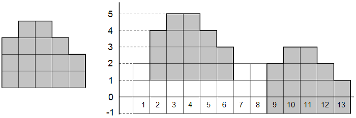

<h1 style='text-align: center;'> D. MUH and Cube Walls</h1>

<h5 style='text-align: center;'>time limit per test: 2 seconds</h5>
<h5 style='text-align: center;'>memory limit per test: 256 megabytes</h5>

Polar bears Menshykov and Uslada from the zoo of St. Petersburg and elephant Horace from the zoo of Kiev got hold of lots of wooden cubes somewhere. They started making cube towers by placing the cubes one on top of the other. They defined multiple towers standing in a line as a wall. A wall can consist of towers of different heights.

Horace was the first to finish making his wall. He called his wall an elephant. The wall consists of *w* towers. The bears also finished making their wall but they didn't give it a name. Their wall consists of *n* towers. Horace looked at the bears' tower and wondered: in how many parts of the wall can he "see an elephant"? He can "see an elephant" on a segment of *w* contiguous towers if the heights of the towers on the segment match as a sequence the heights of the towers in Horace's wall. In order to see as many elephants as possible, Horace can raise and lower his wall. He even can lower the wall below the ground level (see the pictures to the samples for clarification).

Your task is to count the number of segments where Horace can "see an elephant".

## Input

The first line contains two integers *n* and *w* (1 ≤ *n*, *w* ≤ 2·105) — the number of towers in the bears' and the elephant's walls correspondingly. The second line contains *n* integers *a**i* (1 ≤ *a**i* ≤ 109) — the heights of the towers in the bears' wall. The third line contains *w* integers *b**i* (1 ≤ *b**i* ≤ 109) — the heights of the towers in the elephant's wall.

## Output

Print the number of segments in the bears' wall where Horace can "see an elephant".

## Examples

## Input


```
13 5  
2 4 5 5 4 3 2 2 2 3 3 2 1  
3 4 4 3 2  

```
## Output


```
2
```
## Note

The picture to the left shows Horace's wall from the sample, the picture to the right shows the bears' wall. The segments where Horace can "see an elephant" are in gray.

  

#### tags 

#1800 #string_suffix_structures #strings 