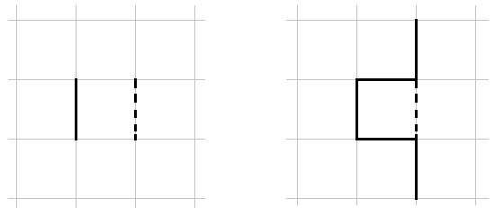

<h1 style='text-align: center;'> E. MUH and Lots and Lots of Segments</h1>

<h5 style='text-align: center;'>time limit per test: 2 seconds</h5>
<h5 style='text-align: center;'>memory limit per test: 512 megabytes</h5>

Polar bears Menshykov and Uslada from the zoo of St. Petersburg and elephant Horace from the zoo of Kiev decided to do some painting. As they were trying to create their first masterpiece, they made a draft on a piece of paper. The draft consists of *n* segments. Each segment was either horizontal or vertical. Now the friends want to simplify the draft by deleting some segments or parts of segments so that the final masterpiece meets three conditions:

1. Horace wants to be able to paint the whole picture in one stroke: by putting the brush on the paper and never taking it off until the picture is ready. The brush can paint the same place multiple times. That's why all the remaining segments must form a single connected shape.
2. Menshykov wants the resulting shape to be simple. He defines a simple shape as a shape that doesn't contain any cycles.
3. Initially all the segment on the draft have integer startpoint and endpoint coordinates. Uslada doesn't like real coordinates and she wants this condition to be fulfilled after all the changes.

As in other parts the draft is already beautiful, the friends decided to delete such parts of the draft that the sum of lengths of the remaining segments is as large as possible. Your task is to count this maximum sum of the lengths that remain after all the extra segments are removed.

## Input

The first line of the input contains integer *n* (1 ≤ *n* ≤ 2·105) — the number of segments on the draft. The next *n* lines contain four integers each: *x*1, *y*1, *x*2, *y*2 ( - 109 ≤ *x*1 ≤ *x*2 ≤ 109;  - 109 ≤ *y*1 ≤ *y*2 ≤ 109) — the two startpoint and the two endpoint coordinates of a segment. All segments are non-degenerative and either are strictly horizontal or strictly vertical.

No two horizontal segments share common points. No two vertical segments share common points.

## Output

Print a single integer — the maximum sum of lengths for the remaining segments.

## Examples

## Input


```
2  
0 0 0 1  
1 0 1 1  

```
## Output


```
1
```
## Input


```
4  
0 0 1 0  
0 0 0 1  
1 -1 1 2  
0 1 1 1  

```
## Output


```
5
```
## Note

The shapes that you can get in the two given samples are:

  In the first sample you need to delete any segment as the two segments together do not form a single connected shape.

In the second sample the initial segments form a cycle, there are four ways to break the cycle: delete the first, second or fourth segment altogether or delete the middle of the third segment. The last way is shown on the picture.


#### tags 

#2700 #data_structures #dsu 