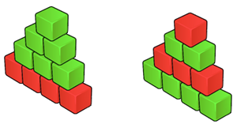

<h1 style='text-align: center;'> D. Red-Green Towers</h1>

<h5 style='text-align: center;'>time limit per test: 2 seconds</h5>
<h5 style='text-align: center;'>memory limit per test: 256 megabytes</h5>

There are *r* red and *g* green blocks for construction of the red-green tower. Red-green tower can be built following next rules:

 

* Red-green tower is consisting of some number of levels;
* Let the red-green tower consist of *n* levels, then the first level of this tower should consist of *n* blocks, second level — of *n* - 1 blocks, the third one — of *n* - 2 blocks, and so on — the last level of such tower should consist of the one block. In other words, each successive level should contain one block less than the previous one;
* Each level of the red-green tower should contain blocks of the same color.

  Let *h* be the maximum possible number of levels of red-green tower, that can be built out of *r* red and *g* green blocks meeting the rules above. The task is to determine how many different red-green towers having *h* levels can be built out of the available blocks.

Two red-green towers are considered different if there exists some level, that consists of red blocks in the one tower and consists of green blocks in the other tower.

You are to write a program that will find the number of different red-green towers of height *h* modulo 109 + 7.

## Input

The only line of input contains two integers *r* and *g*, separated by a single space — the number of available red and green blocks respectively (0 ≤ *r*, *g* ≤ 2·105, *r* + *g* ≥ 1).

## Output

## Output

 the only integer — the number of different possible red-green towers of height *h* modulo 109 + 7.

## Examples

## Input


```
4 6  

```
## Output


```
2  

```
## Input


```
9 7  

```
## Output


```
6  

```
## Input


```
1 1  

```
## Output


```
2  

```
## Note

The image in the problem statement shows all possible red-green towers for the first sample.


#### tags 

#2000 #dp 