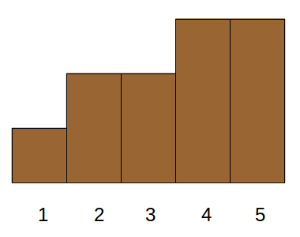
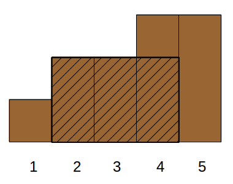
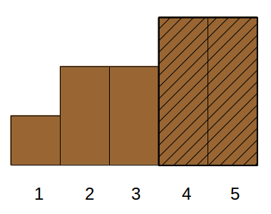

<h1 style='text-align: center;'> E. Sign on Fence</h1>

<h5 style='text-align: center;'>time limit per test: 4 seconds</h5>
<h5 style='text-align: center;'>memory limit per test: 256 megabytes</h5>

Bizon the Champion has recently finished painting his wood fence. The fence consists of a sequence of *n* panels of 1 meter width and of arbitrary height. The *i*-th panel's height is *h**i* meters. The adjacent planks follow without a gap between them.

After Bizon painted the fence he decided to put a "for sale" sign on it. The sign will be drawn on a rectangular piece of paper and placed on the fence so that the sides of the sign are parallel to the fence panels and are also aligned with the edges of some panels. Bizon the Champion introduced the following constraints for the sign position:

1. The width of the sign should be exactly *w* meters.
2. The sign must fit into the segment of the fence from the *l*-th to the *r*-th panels, inclusive (also, it can't exceed the fence's bound in vertical direction).

The sign will be really pretty, So Bizon the Champion wants the sign's height to be as large as possible.

You are given the description of the fence and several queries for placing sign. For each query print the maximum possible height of the sign that can be placed on the corresponding segment of the fence with the given fixed width of the sign.

## Input

The first line of the input contains integer *n* — the number of panels in the fence (1 ≤ *n* ≤ 105). 

The second line contains *n* space-separated integers *h**i*, — the heights of the panels (1 ≤ *h**i* ≤ 109). 

The third line contains an integer *m* — the number of the queries (1 ≤ *m* ≤ 105). 

The next *m* lines contain the descriptions of the queries, each query is represented by three integers *l*, *r* and *w* (1 ≤ *l* ≤ *r* ≤ *n*, 1 ≤ *w* ≤ *r* - *l* + 1) — the segment of the fence and the width of the sign respectively.

## Output

For each query print the answer on a separate line — the maximum height of the sign that can be put in the corresponding segment of the fence with all the conditions being satisfied.

## Examples

## Input


```
5  
1 2 2 3 3  
3  
2 5 3  
2 5 2  
1 5 5  

```
## Output


```
2  
3  
1  

```
## Note

The fence described in the sample looks as follows: 

  The possible positions for the signs for all queries are given below.

  The optimal position of the sign for the first query.   The optimal position of the sign for the second query.   The optimal position of the sign for the third query. 

#### tags 

#2500 #binary_search #constructive_algorithms #data_structures 