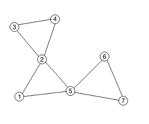

<h1 style='text-align: center;'> E. Tourists</h1>

<h5 style='text-align: center;'>time limit per test: 2 seconds</h5>
<h5 style='text-align: center;'>memory limit per test: 256 megabytes</h5>

There are *n* cities in Cyberland, numbered from 1 to *n*, connected by *m* bidirectional roads. The *j*-th road connects city *a**j* and *b**j*.

For tourists, souvenirs are sold in every city of Cyberland. In particular, city *i* sell it at a price of *w**i*.

Now there are *q* queries for you to handle. There are two types of queries:

* "C *a* *w*": The price in city *a* is changed to *w*.
* "A *a* *b*": Now a tourist will travel from city *a* to *b*. He will choose a route, he also doesn't want to visit a city twice. He will buy souvenirs at the city where the souvenirs are the cheapest (possibly exactly at city *a* or *b*). You should output the minimum possible price that he can buy the souvenirs during his travel.

More formally, we can define routes as follow:

* A route is a sequence of cities [*x*1, *x*2, ..., *x**k*], where *k* is a certain positive integer.
* For any 1 ≤ *i* < *j* ≤ *k*, *x**i* ≠ *x**j*.
* For any 1 ≤ *i* < *k*, there is a road connecting *x**i* and *x**i* + 1.
* The minimum price of the route is *min*(*w**x*1, *w**x*2, ..., *w**x**k*).
* The required answer is the minimum value of the minimum prices of all valid routes from *a* to *b*.
## Input

The first line of input contains three integers *n*, *m*, *q* (1 ≤ *n*, *m*, *q* ≤ 105), separated by a single space.

Next *n* lines contain integers *w**i* (1 ≤ *w**i* ≤ 109).

Next *m* lines contain pairs of space-separated integers *a**j* and *b**j* (1 ≤ *a**j*, *b**j* ≤ *n*, *a**j* ≠ *b**j*).

It is guaranteed that there is at most one road connecting the same pair of cities. There is always at least one valid route between any two cities.

Next *q* lines each describe a query. The format is "C *a* *w*" or "A *a* *b*" (1 ≤ *a*, *b* ≤ *n*, 1 ≤ *w* ≤ 109).

## Output

For each query of type "A", output the corresponding answer.

## Examples

## Input


```
3 3 3  
1  
2  
3  
1 2  
2 3  
1 3  
A 2 3  
C 1 5  
A 2 3  

```
## Output


```
1  
2  

```
## Input


```
7 9 4  
1  
2  
3  
4  
5  
6  
7  
1 2  
2 5  
1 5  
2 3  
3 4  
2 4  
5 6  
6 7  
5 7  
A 2 3  
A 6 4  
A 6 7  
A 3 3  

```
## Output


```
2  
1  
5  
3  

```
## Note

For the second sample, an optimal routes are:

From 2 to 3 it is [2, 3].

From 6 to 4 it is [6, 5, 1, 2, 4].

From 6 to 7 it is [6, 5, 7].

From 3 to 3 it is [3].

  

#### tags 

#3200 #data_structures #dfs_and_similar #graphs #trees 