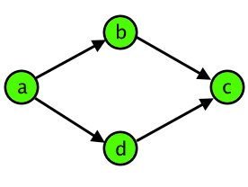

<h1 style='text-align: center;'> D. Unbearable Controversy of Being</h1>

<h5 style='text-align: center;'>time limit per test: 1 second</h5>
<h5 style='text-align: center;'>memory limit per test: 256 megabytes</h5>

Tomash keeps wandering off and getting lost while he is walking along the streets of Berland. It's no surprise! In his home town, for any pair of intersections there is exactly one way to walk from one intersection to the other one. The capital of Berland is very different!

Tomash has noticed that even simple cases of ambiguity confuse him. So, when he sees a group of four distinct intersections *a*, *b*, *c* and *d*, such that there are two paths from *a* to *c* — one through *b* and the other one through *d*, he calls the group a "damn rhombus". Note that pairs (*a*, *b*), (*b*, *c*), (*a*, *d*), (*d*, *c*) should be directly connected by the roads. Schematically, a damn rhombus is shown on the figure below:

  Other roads between any of the intersections don't make the rhombus any more appealing to Tomash, so the four intersections remain a "damn rhombus" for him.

Given that the capital of Berland has *n* intersections and *m* roads and all roads are unidirectional and are known in advance, find the number of "damn rhombi" in the city.

When rhombi are compared, the order of intersections *b* and *d* doesn't matter.

## Input

The first line of the input contains a pair of integers *n*, *m* (1 ≤ *n* ≤ 3000, 0 ≤ *m* ≤ 30000) — the number of intersections and roads, respectively. Next *m* lines list the roads, one per line. Each of the roads is given by a pair of integers *a**i*, *b**i* (1 ≤ *a**i*, *b**i* ≤ *n*;*a**i* ≠ *b**i*) — the number of the intersection it goes out from and the number of the intersection it leads to. Between a pair of intersections there is at most one road in each of the two directions.

It is not guaranteed that you can get from any intersection to any other one.

## Output

Print the required number of "damn rhombi".

## Examples

## Input


```
5 4  
1 2  
2 3  
1 4  
4 3  

```
## Output


```
1  

```
## Input


```
4 12  
1 2  
1 3  
1 4  
2 1  
2 3  
2 4  
3 1  
3 2  
3 4  
4 1  
4 2  
4 3  

```
## Output


```
12  

```


#### tags 

#1700 #brute_force #combinatorics #dfs_and_similar #graphs 