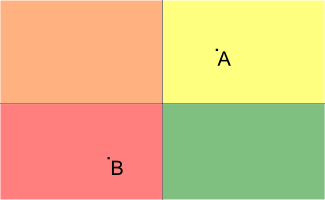
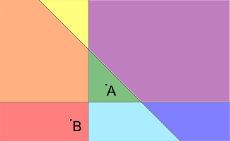

<h1 style='text-align: center;'> A. Crazy Town</h1>

<h5 style='text-align: center;'>time limit per test: 1 second</h5>
<h5 style='text-align: center;'>memory limit per test: 256 megabytes</h5>

Crazy Town is a plane on which there are *n* infinite line roads. Each road is defined by the equation *a**i**x* + *b**i**y* + *c**i* = 0, where *a**i* and *b**i* are not both equal to the zero. The roads divide the plane into connected regions, possibly of infinite space. Let's call each such region a block. We define an intersection as the point where at least two different roads intersect.

Your home is located in one of the blocks. Today you need to get to the University, also located in some block. In one step you can move from one block to another, if the length of their common border is nonzero (in particular, this means that if the blocks are adjacent to one intersection, but have no shared nonzero boundary segment, then it are not allowed to move from one to another one in one step).

Determine what is the minimum number of steps you have to perform to get to the block containing the university. It is guaranteed that neither your home nor the university is located on the road.

## Input

The first line contains two space-separated integers *x*1, *y*1 ( - 106 ≤ *x*1, *y*1 ≤ 106) — the coordinates of your home.

The second line contains two integers separated by a space *x*2, *y*2 ( - 106 ≤ *x*2, *y*2 ≤ 106) — the coordinates of the university you are studying at.

The third line contains an integer *n* (1 ≤ *n* ≤ 300) — the number of roads in the city. The following *n* lines contain 3 space-separated integers ( - 106 ≤ *a**i*, *b**i*, *c**i* ≤ 106; |*a**i*| + |*b**i*| > 0) — the coefficients of the line *a**i**x* + *b**i**y* + *c**i* = 0, defining the *i*-th road. It is guaranteed that no two roads are the same. In addition, neither your home nor the university lie on the road (i.e. they do not belong to any one of the lines).

## Output

## Output

 the answer to the problem.

## Examples

## Input


```
1 1  
-1 -1  
2  
0 1 0  
1 0 0  

```
## Output


```
2  

```
## Input


```
1 1  
-1 -1  
3  
1 0 0  
0 1 0  
1 1 -3  

```
## Output


```
2  

```
## Note

Pictures to the samples are presented below (A is the point representing the house; B is the point representing the university, different blocks are filled with different colors):

    

#### tags 

#1700 #geometry 