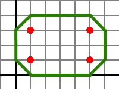

<h1 style='text-align: center;'> C. Happy Farm 5</h1>

<h5 style='text-align: center;'>time limit per test: 2 seconds</h5>
<h5 style='text-align: center;'>memory limit per test: 256 megabytes</h5>

The Happy Farm 5 creators decided to invent the mechanism of cow grazing. The cows in the game are very slow and they move very slowly, it can even be considered that they stand still. However, carnivores should always be chased off them. 

For that a young player Vasya decided to make the shepherd run round the cows along one and the same closed path. It is very important that the cows stayed strictly inside the area limited by the path, as otherwise some cows will sooner or later be eaten. To be absolutely sure in the cows' safety, Vasya wants the path completion time to be minimum.

The new game is launched for different devices, including mobile phones. That's why the developers decided to quit using the arithmetics with the floating decimal point and use only the arithmetics of integers. The cows and the shepherd in the game are represented as points on the plane with integer coordinates. The playing time is modeled by the turns. During every turn the shepherd can either stay where he stands or step in one of eight directions: horizontally, vertically, or diagonally. As the coordinates should always remain integer, then the length of a horizontal and vertical step is equal to 1, and the length of a diagonal step is equal to . The cows do not move. You have to minimize the number of moves the shepherd needs to run round the whole herd.

## Input

The first line contains an integer *N* which represents the number of cows in the herd (1 ≤ *N* ≤ 105). Each of the next *N* lines contains two integers *X**i* and *Y**i* which represent the coordinates of one cow of (|*X**i*|, |*Y**i*| ≤ 106). Several cows can stand on one point.

## Output

Print the single number — the minimum number of moves in the sought path.

## Examples

## Input


```
4  
1 1  
5 1  
5 3  
1 3  

```
## Output


```
16  

```
## Note

Picture for the example test: The coordinate grid is painted grey, the coordinates axes are painted black, the cows are painted red and the sought route is painted green.

  

#### tags 

#2000 #geometry 