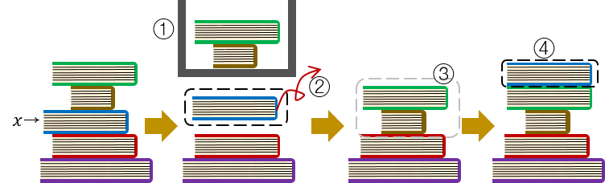
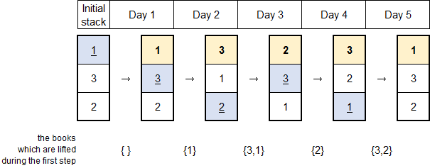

<h1 style='text-align: center;'> C. New Year Book Reading</h1>

<h5 style='text-align: center;'>time limit per test: 2 seconds</h5>
<h5 style='text-align: center;'>memory limit per test: 256 megabytes</h5>

New Year is coming, and Jaehyun decided to read many books during 2015, unlike this year. He has *n* books numbered by integers from 1 to *n*. The weight of the *i*-th (1 ≤ *i* ≤ *n*) book is *w**i*.

As Jaehyun's house is not large enough to have a bookshelf, he keeps the *n* books by stacking them vertically. When he wants to read a certain book *x*, he follows the steps described below.

1. He lifts all the books above book *x*.
2. He pushes book *x* out of the stack.
3. He puts down the lifted books without changing their order.
4. After reading book *x*, he puts book *x* on the top of the stack.

 

He decided to read books for *m* days. In the *j*-th (1 ≤ *j* ≤ *m*) day, he will read the book that is numbered with integer *b**j* (1 ≤ *b**j* ≤ *n*). To read the book, he has to use the process described in the paragraph above. It is possible that he decides to re-read the same book several times.

After making this plan, he realized that the total weight of books he should lift during *m* days would be too heavy. So, he decided to change the order of the stacked books before the New Year comes, and minimize the total weight. You may assume that books can be stacked in any possible order. ## Note

 that book that he is going to read on certain step isn't considered as lifted on that step. Can you help him?

## Input

The first line contains two space-separated integers *n* (2 ≤ *n* ≤ 500) and *m* (1 ≤ *m* ≤ 1000) — the number of books, and the number of days for which Jaehyun would read books.

The second line contains *n* space-separated integers *w*1, *w*2, ..., *w**n* (1 ≤ *w**i* ≤ 100) — the weight of each book.

The third line contains *m* space separated integers *b*1, *b*2, ..., *b**m* (1 ≤ *b**j* ≤ *n*) — the order of books that he would read. ## Note

 that he can read the same book more than once.

## Output

Print the minimum total weight of books he should lift, which can be achieved by rearranging the order of stacked books.

## Examples

## Input


```
3 5  
1 2 3  
1 3 2 3 1  

```
## Output


```
12  

```
## Note

Here's a picture depicting the example. Each vertical column presents the stacked books.

  

#### tags 

#1600 #constructive_algorithms #greedy #implementation #math 