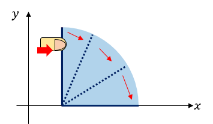
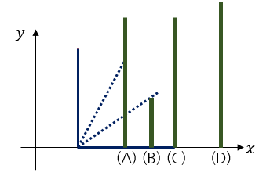
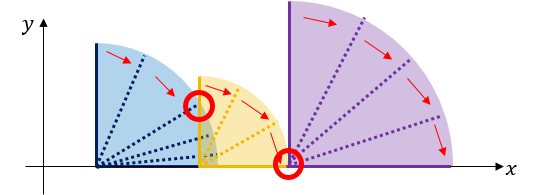
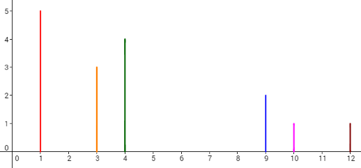
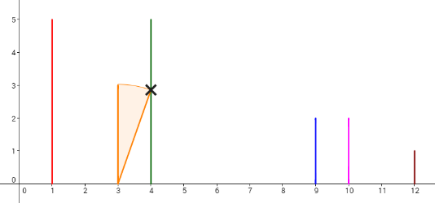
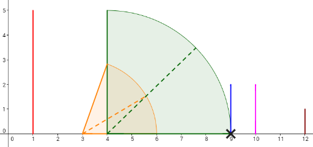
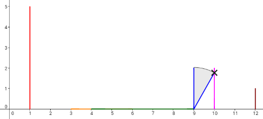
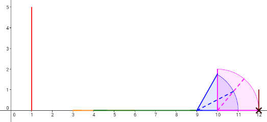
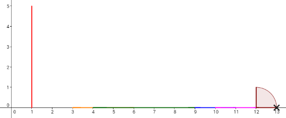

<h1 style='text-align: center;'> E. New Year Domino</h1>

<h5 style='text-align: center;'>time limit per test: 2 seconds</h5>
<h5 style='text-align: center;'>memory limit per test: 256 megabytes</h5>

Celebrating the new year, many people post videos of falling dominoes; Here's a list of them: https://www.youtube.com/results?search_query=New+Years+Dominos 

User ainta, who lives in a 2D world, is going to post a video as well.

There are *n* dominoes on a 2D Cartesian plane. *i*-th domino (1 ≤ *i* ≤ *n*) can be represented as a line segment which is parallel to the *y*-axis and whose length is *l**i*. The lower point of the domino is on the *x*-axis. Let's denote the *x*-coordinate of the *i*-th domino as *p**i*. Dominoes are placed one after another, so *p*1 < *p*2 < ... < *p**n* - 1 < *p**n* holds.

User ainta wants to take a video of falling dominoes. To make dominoes fall, he can push a single domino to the right. Then, the domino will fall down drawing a circle-shaped orbit until the line segment totally overlaps with the x-axis. 

  Also, if the *s*-th domino touches the *t*-th domino while falling down, the *t*-th domino will also fall down towards the right, following the same procedure above. Domino *s* touches domino *t* if and only if the segment representing *s* and *t* intersects. 

  See the picture above. If he pushes the leftmost domino to the right, it falls down, touching dominoes (A), (B) and (C). As a result, dominoes (A), (B), (C) will also fall towards the right. However, domino (D) won't be affected by pushing the leftmost domino, but eventually it will fall because it is touched by domino (C) for the first time.

  The picture above is an example of falling dominoes. Each red circle denotes a touch of two dominoes.

User ainta has *q* plans of posting the video. *j*-th of them starts with pushing the *x**j*-th domino, and lasts until the *y**j*-th domino falls. But sometimes, it could be impossible to achieve such plan, so he has to lengthen some dominoes. It costs one dollar to increase the length of a single domino by 1. User ainta wants to know, for each plan, the minimum cost needed to achieve it. Plans are processed independently, i. e. if domino's length is increased in some plan, it doesn't affect its length in other plans. Set of dominos that will fall except *x**j*-th domino and *y**j*-th domino doesn't matter, but the initial push should be on domino *x**j*.

## Input

The first line contains an integer *n* (2 ≤ *n* ≤ 2 × 105)— the number of dominoes.

Next *n* lines describe the dominoes. The *i*-th line (1 ≤ *i* ≤ *n*) contains two space-separated integers *p**i*, *l**i* (1 ≤ *p**i*, *l**i* ≤ 109)— the *x*-coordinate and the length of the *i*-th domino. It is guaranteed that *p*1 < *p*2 < ... < *p**n* - 1 < *p**n*.

The next line contains an integer *q* (1 ≤ *q* ≤ 2 × 105) — the number of plans.

Next *q* lines describe the plans. The *j*-th line (1 ≤ *j* ≤ *q*) contains two space-separated integers *x**j*, *y**j* (1 ≤ *x**j* < *y**j* ≤ *n*). It means the *j*-th plan is, to push the *x**j*-th domino, and shoot a video until the *y**j*-th domino falls.

## Output

For each plan, print a line containing the minimum cost needed to achieve it. If no cost is needed, print 0.

## Examples

## Input


```
6  
1 5  
3 3  
4 4  
9 2  
10 1  
12 1  
4  
1 2  
2 4  
2 5  
2 6  

```
## Output


```
0  
1  
1  
2  

```
## Note

Consider the example. The dominoes are set like the picture below.

  Let's take a look at the 4th plan. To make the 6th domino fall by pushing the 2nd domino, the length of the 3rd domino (whose x-coordinate is 4) should be increased by 1, and the 5th domino (whose x-coordinate is 9) should be increased by 1 (other option is to increase 4th domino instead of 5th also by 1). Then, the dominoes will fall like in the picture below. Each cross denotes a touch between two dominoes. 

          

#### tags 

#2300 #data_structures #dp #dsu 