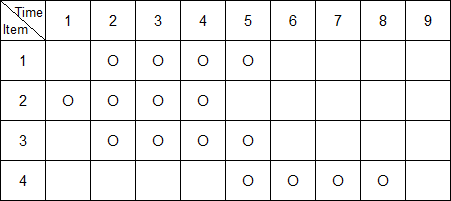

<h1 style='text-align: center;'> F. New Year Shopping</h1>

<h5 style='text-align: center;'>time limit per test: 2 seconds</h5>
<h5 style='text-align: center;'>memory limit per test: 256 megabytes</h5>

Dohyun is running a grocery store. He sells *n* items numbered by integers from 1 to *n*. The *i*-th (1 ≤ *i* ≤ *n*) of them costs *c**i* dollars, and if I buy it, my happiness increases by *h**i*. Each item can be displayed only for *p* units of time because of freshness. As Dohyun displays the *i*-th item at time *t**i*, the customers can buy the *i*-th item only from time *t**i* to time *t**i* + (*p* - 1) inclusively. Also, each customer cannot buy the same item more than once.

I'd like to visit Dohyun's grocery store and buy some items for the New Year Party, and maximize my happiness. Because I am a really busy person, I can visit the store only once, and for very short period of time. In other words, if I visit the store at time *t*, I can only buy the items available at time *t*. But I can buy as many items as possible, if the budget holds. I can't buy same item several times due to store rules. It is not necessary to use the whole budget.

I made a list of *q* pairs of integers (*a**j*, *b**j*), which means I may visit the store at time *a**j*, and spend at most *b**j* dollars at the store. For each pair, I'd like to know the maximum happiness I can obtain. But there are so many pairs that I can't handle them. Can you help me?

## Input

The first line contains two space-separated integers *n* and *p* (1 ≤ *n* ≤ 4000, 1 ≤ *p* ≤ 10 000) — the number of items, and the display time of each item.

Next *n* lines describe the items. The *i*-th (1 ≤ *i* ≤ *n*) of them contains three space-separated integers *c**i*, *h**i*, *t**i* (1 ≤ *c**i*, *h**i* ≤ 4000, 1 ≤ *t**i* ≤ 10 000) — the cost of the *i*-th item, the happiness of the *i*-th item, and the time when the *i*-th item starts to be displayed.

The next line contains an integer *q* (1 ≤ *q* ≤ 20 000)— the number of candidates.

Next *q* lines describe the candidates. The *j*-th (1 ≤ *j* ≤ *q*) of them contains two space-separated integers *a**j*, *b**j* (1 ≤ *a**j* ≤ 20 000, 1 ≤ *b**j* ≤ 4000) — the visit time and the budget for *j*-th visit of store.

## Output

For each candidate, print a single line containing the maximum happiness that I can obtain by buying some items.

## Examples

## Input


```
4 4  
2 3 2  
3 5 1  
4 7 2  
11 15 5  
4  
1 3  
2 5  
2 6  
5 14  

```
## Output


```
5  
8  
10  
18  

```
## Input


```
5 4  
3 2 1  
7 4 4  
2 1 2  
6 3 5  
3 2 2  
10  
1 5  
2 5  
4 8  
4 9  
4 10  
5 8  
5 9  
5 10  
8 4  
7 9  

```
## Output


```
2  
3  
5  
5  
6  
4  
5  
6  
0  
4  

```
## Note

Consider the first sample. 

  1. At time 1, only the 2nd item is available. I can buy the 2nd item using 3 dollars and my happiness will increase by 5.
2. At time 2, the 1st, 2nd, and 3rd item is available. I can buy the 1st item using 2 dollars, and the 2nd item using 3 dollars. My happiness will increase by 3 + 5 = 8.
3. At time 2, the 1st, 2nd, and 3rd item is available. I can buy the 1st item using 2 dollars, and the 3nd item using 4 dollars. My happiness will increase by 3 + 7 = 10.
4. At time 5, the 1st, 3rd, and 4th item is available. I can buy the 1st item using 2 dollars, and the 4th item using 11 dollars. My happiness will increase by 3 + 15 = 18. ## Note

 that I don't need to use the whole budget in this case.


#### tags 

#2700 #divide_and_conquer #dp 