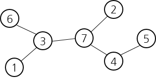

<h1 style='text-align: center;'> G. New Year Running</h1>

<h5 style='text-align: center;'>time limit per test: 4 seconds</h5>
<h5 style='text-align: center;'>memory limit per test: 256 megabytes</h5>

New Year is coming in Tree Island! In this island, as the name implies, there are *n* cities connected by *n* - 1 roads, and for any two distinct cities there always exists exactly one path between them. For every person in Tree Island, it takes exactly one minute to pass by exactly one road.

There is a weird New Year tradition for runnners in Tree Island, which is called "extreme run". This tradition can be done as follows.

A runner chooses two distinct cities *a* and *b*. For simplicity, let's denote the shortest path from city *a* to city *b* as *p*1, *p*2, ..., *p**l* (here, *p*1 = *a* and *p**l* = *b* holds). Then following happens:

1. The runner starts at city *a*.
2. The runner runs from city *a* to *b*, following the shortest path from city *a* to city *b*.
3. When the runner arrives at city *b*, he turns his direction immediately (it takes no time), and runs towards city *a*, following the shortest path from city *b* to city *a*.
4. When the runner arrives at city *a*, he turns his direction immediately (it takes no time), and runs towards city *b*, following the shortest path from city *a* to city *b*.
5. Repeat step 3 and step 4 forever.

In short, the course of the runner can be denoted as:  

Two runners JH and JY decided to run "extremely" in order to celebrate the New Year. JH has chosen two cities *u* and *v*, and JY has chosen two cities *x* and *y*. They decided to start running at the same moment, and run until they meet at the same city for the first time. Meeting on a road doesn't matter for them. Before running, they want to know the amount of time they will run.

It is too hard for JH and JY to calculate this, so they ask you for help.

## Input

The first line contains a single positive integer *n* (5 ≤ *n* ≤ 2 × 105) — the number of cities in Tree Island.

Next *n* - 1 lines describe the roads of Tree Island. The *i*-th line (1 ≤ *i* ≤ *n* - 1) of them contains two space-separated integers *a**i* and *b**i* (1 ≤ *a**i*, *b**i* ≤ *n*, *a**i* ≠ *b**i*) — the vertices connected by a single road of the tree.

The next line contains an integer *t* (1 ≤ *t* ≤ 2 × 105) — the number of test cases.

Next *t* lines describes the test cases. The *j*-th line (1 ≤ *j* ≤ *t*) of them contains four space-separated integers *u**j*, *v**j*, *x**j*, *y**j* (1 ≤ *u**j*, *v**j*, *x**j*, *y**j* ≤ *n*, *u**j* ≠ *v**j*, *x**j* ≠ *y**j*). It means that in this test case, JH has chosen two cities *u**j* and *v**j*, JY has chosen two cities *x**j* and *y**j*. JH starts running at city *u**j*, and JY starts running at city *x**j*.

## Output

For each test case, print an integer describing the amount of time they should run in minutes. If they have to run for an infinitely long time (in other words, if they never meet at the same city), print -1 instead. If they meet at the beginning of their run, print 0.

## Examples

## Input


```
7  
1 3  
3 6  
7 4  
3 7  
5 4  
7 2  
4  
6 5 5 3  
3 5 4 6  
1 5 1 3  
1 5 3 1  

```
## Output


```
2  
1  
0  
-1  

```
## Note

The example looks like:

  

#### tags 

#3200 #number_theory #trees 