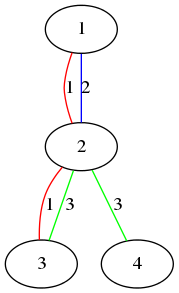

<h1 style='text-align: center;'> B. Mr. Kitayuta's Colorful Graph</h1>

<h5 style='text-align: center;'>time limit per test: 1 second</h5>
<h5 style='text-align: center;'>memory limit per test: 256 megabytes</h5>

Mr. Kitayuta has just bought an undirected graph consisting of *n* vertices and *m* edges. The vertices of the graph are numbered from 1 to *n*. Each edge, namely edge *i*, has a color *c**i*, connecting vertex *a**i* and *b**i*.

Mr. Kitayuta wants you to process the following *q* queries.

In the *i*-th query, he gives you two integers — *u**i* and *v**i*.

Find the number of the colors that satisfy the following condition: the edges of that color connect vertex *u**i* and vertex *v**i* directly or indirectly.

## Input

The first line of the input contains space-separated two integers — *n* and *m* (2 ≤ *n* ≤ 100, 1 ≤ *m* ≤ 100), denoting the number of the vertices and the number of the edges, respectively.

The next *m* lines contain space-separated three integers — *a**i*, *b**i* (1 ≤ *a**i* < *b**i* ≤ *n*) and *c**i* (1 ≤ *c**i* ≤ *m*). ## Note

 that there can be multiple edges between two vertices. However, there are no multiple edges of the same color between two vertices, that is, if *i* ≠ *j*, (*a**i*, *b**i*, *c**i*) ≠ (*a**j*, *b**j*, *c**j*).

The next line contains a integer — *q* (1 ≤ *q* ≤ 100), denoting the number of the queries.

Then follows *q* lines, containing space-separated two integers — *u**i* and *v**i* (1 ≤ *u**i*, *v**i* ≤ *n*). It is guaranteed that *u**i* ≠ *v**i*.

## Output

For each query, print the answer in a separate line.

## Examples

## Input


```
4 5  
1 2 1  
1 2 2  
2 3 1  
2 3 3  
2 4 3  
3  
1 2  
3 4  
1 4  

```
## Output


```
2  
1  
0  

```
## Input


```
5 7  
1 5 1  
2 5 1  
3 5 1  
4 5 1  
1 2 2  
2 3 2  
3 4 2  
5  
1 5  
5 1  
2 5  
1 5  
1 4  

```
## Output


```
1  
1  
1  
1  
2  

```
## Note

Let's consider the first sample. 

  The figure above shows the first sample.  * Vertex 1 and vertex 2 are connected by color 1 and 2.
* Vertex 3 and vertex 4 are connected by color 3.
* Vertex 1 and vertex 4 are not connected by any single color.


#### tags 

#1400 #dfs_and_similar #dp #dsu #graphs 