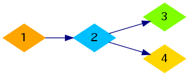
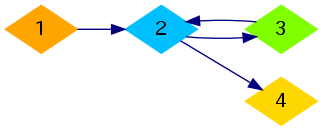

<h1 style='text-align: center;'> D. Mr. Kitayuta's Technology</h1>

<h5 style='text-align: center;'>time limit per test: 1 second</h5>
<h5 style='text-align: center;'>memory limit per test: 256 megabytes</h5>

Shuseki Kingdom is the world's leading nation for innovation and technology. There are *n* cities in the kingdom, numbered from 1 to *n*.

Thanks to Mr. Kitayuta's research, it has finally become possible to construct teleportation pipes between two cities. A teleportation pipe will connect two cities unidirectionally, that is, a teleportation pipe from city *x* to city *y* cannot be used to travel from city *y* to city *x*. The transportation within each city is extremely developed, therefore if a pipe from city *x* to city *y* and a pipe from city *y* to city *z* are both constructed, people will be able to travel from city *x* to city *z* instantly.

Mr. Kitayuta is also involved in national politics. He considers that the transportation between the *m* pairs of city (*a**i*, *b**i*) (1 ≤ *i* ≤ *m*) is important. He is planning to construct teleportation pipes so that for each important pair (*a**i*, *b**i*), it will be possible to travel from city *a**i* to city *b**i* by using one or more teleportation pipes (but not necessarily from city *b**i* to city *a**i*). Find the minimum number of teleportation pipes that need to be constructed. So far, no teleportation pipe has been constructed, and there is no other effective transportation between cities.

## Input

The first line contains two space-separated integers *n* and *m* (2 ≤ *n* ≤ 105, 1 ≤ *m* ≤ 105), denoting the number of the cities in Shuseki Kingdom and the number of the important pairs, respectively.

The following *m* lines describe the important pairs. The *i*-th of them (1 ≤ *i* ≤ *m*) contains two space-separated integers *a**i* and *b**i* (1 ≤ *a**i*, *b**i* ≤ *n*, *a**i* ≠ *b**i*), denoting that it must be possible to travel from city *a**i* to city *b**i* by using one or more teleportation pipes (but not necessarily from city *b**i* to city *a**i*). It is guaranteed that all pairs (*a**i*, *b**i*) are distinct.

## Output

Print the minimum required number of teleportation pipes to fulfill Mr. Kitayuta's purpose.

## Examples

## Input


```
4 5  
1 2  
1 3  
1 4  
2 3  
2 4  

```
## Output


```
3  

```
## Input


```
4 6  
1 2  
1 4  
2 3  
2 4  
3 2  
3 4  

```
## Output


```
4  

```
## Note

For the first sample, one of the optimal ways to construct pipes is shown in the image below: 

  For the second sample, one of the optimal ways is shown below: 

  

#### tags 

#2200 #dfs_and_similar 