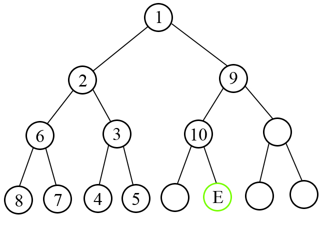

<h1 style='text-align: center;'> C. Guess Your Way Out!</h1>

<h5 style='text-align: center;'>time limit per test: 1 second</h5>
<h5 style='text-align: center;'>memory limit per test: 256 megabytes</h5>

Amr bought a new video game "Guess Your Way Out!". The goal of the game is to find an exit from the maze that looks like a perfect binary tree of height *h*. The player is initially standing at the root of the tree and the exit from the tree is located at some leaf node. 

Let's index all the leaf nodes from the left to the right from 1 to 2*h*. The exit is located at some node *n* where 1 ≤ *n* ≤ 2*h*, the player doesn't know where the exit is so he has to guess his way out!

Amr follows simple algorithm to choose the path. Let's consider infinite command string "LRLRLRLRL..." (consisting of alternating characters 'L' and 'R'). Amr sequentially executes the characters of the string using following rules:

* Character 'L' means "go to the left child of the current node";
* Character 'R' means "go to the right child of the current node";
* If the destination node is already visited, Amr skips current command, otherwise he moves to the destination node;
* If Amr skipped two consecutive commands, he goes back to the parent of the current node before executing next command;
* If he reached a leaf node that is not the exit, he returns to the parent of the current node;
* If he reaches an exit, the game is finished.

Now Amr wonders, if he follows this algorithm, how many nodes he is going to visit before reaching the exit?

## Input

## Input

 consists of two integers *h*, *n* (1 ≤ *h* ≤ 50, 1 ≤ *n* ≤ 2*h*).

## Output

## Output

 a single integer representing the number of nodes (excluding the exit node) Amr is going to visit before reaching the exit by following this algorithm.

## Examples

## Input


```
1 2  

```
## Output


```
2
```
## Input


```
2 3  

```
## Output


```
5
```
## Input


```
3 6  

```
## Output


```
10
```
## Input


```
10 1024  

```
## Output


```
2046
```
## Note

A perfect binary tree of height *h* is a binary tree consisting of *h* + 1 levels. Level 0 consists of a single node called root, level *h* consists of 2*h* nodes called leaves. Each node that is not a leaf has exactly two children, left and right one. 

Following picture illustrates the sample test number 3. Nodes are labeled according to the order of visit.




#### tags 

#1700 #implementation #math #trees 