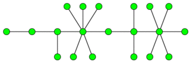

<h1 style='text-align: center;'> F. Caterpillar</h1>

<h5 style='text-align: center;'>time limit per test: 2 seconds</h5>
<h5 style='text-align: center;'>memory limit per test: 256 megabytes</h5>

An undirected graph is called a caterpillar if it is a connected graph without cycles and it has such a path *p* that any vertex is located at a distance of at most 1 from the path *p*. The caterpillar can contain loops (edges from a vertex to itself) but cannot contain multiple (parallel) edges.

The picture contains an example of a caterpillar: 

  You are given an undirected graph *G*. You are allowed to do a merging operations, each such operation merges two vertices into one vertex. For that two any vertices *a* and *b* (*a* ≠ *b*) are chosen. These verteces are deleted together with their edges (which are incident to at least one of the vertices *a* or *b*) but a new vertex *w* is added together with edges (*x*, *w*) for each edge (*a*, *w*) and/or (*b*, *w*). If there was the edge (*a*, *b*) it transforms to the loop (*w*, *w*). The resulting graph (after the merging operation) may contain multiple (parallel) edges between pairs of vertices and loops. Let us note that this operation decreases the number of vertices of graph by 1 but leaves the number of edges in the graph unchanged.

The merging operation can be informally described as a unity of two vertices of the graph into one with the natural transformation of the graph edges.

You may apply this operation consecutively and make the given graph to be a caterpillar. Write a program that will print the minimal number of merging operations required to make the given graph a caterpillar.

## Input

The first line contains a pair of integers *n*, *m* (1 ≤ *n* ≤ 2000;0 ≤ *m* ≤ 105), where *n* represents the number of vertices in the graph and *m* is the number of edges in it. Then the following *m* lines contain edge descriptions, one edge description per line. Every line contains a pair of integers *a**i*, *b**i* (1 ≤ *a**i*, *b**i* ≤ *n*;*a**i* ≠ *b**i*), *a**i*, *b**i* which represent the indices of the vertices connected by the edge. The vertices are numbered from 1 to *n*. In the given graph it will be no more than one edge between any pair of vertices. The given graph is not necessarily connected.

## Output

Print the minimal required number of operations.

## Examples

## Input


```
4 4  
1 2  
2 3  
3 4  
4 2  

```
## Output


```
2  

```
## Input


```
6 3  
1 2  
3 4  
5 6  

```
## Output


```
2  

```
## Input


```
7 6  
1 2  
2 3  
1 4  
4 5  
1 6  
6 7  

```
## Output


```
1  

```


#### tags 

#2800 #dfs_and_similar #dp #graphs #trees 