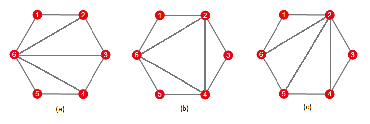

<h1 style='text-align: center;'> E. Fox And Polygon</h1>

<h5 style='text-align: center;'>time limit per test: 2 seconds</h5>
<h5 style='text-align: center;'>memory limit per test: 256 megabytes</h5>

Fox Ciel just designed a puzzle game called "Polygon"! It is played using triangulations of a regular *n*-edge polygon. The goal is to transform one triangulation to another by some tricky rules.

Triangulation of an *n*-edge poylgon is a set of *n* - 3 diagonals satisfying the condition that no two diagonals share a common internal point.

For example, the initial state of the game may look like (a) in above figure. And your goal may look like (c). In each step you can choose a diagonal inside the polygon (but not the one of edges of the polygon) and flip this diagonal. 

Suppose you are going to flip a diagonal *a* – *b*. There always exist two triangles sharing *a* – *b* as a side, let's denote them as *a* – *b* – *c* and *a* – *b* – *d*. As a result of this operation, the diagonal *a* – *b* is replaced by a diagonal *c* – *d*. It can be easily proven that after flip operation resulting set of diagonals is still a triangulation of the polygon.

So in order to solve above case, you may first flip diagonal 6 – 3, it will be replaced by diagonal 2 – 4. Then you flip diagonal 6 – 4 and get figure (c) as result.

Ciel just proved that for any starting and destination triangulations this game has a solution. She wants you to solve it in no more than 20 000 steps for any puzzle satisfying *n* ≤ 1000.

## Input

The first line contain an integer *n* (4 ≤ *n* ≤ 1000), number of edges of the regular polygon. 

Then follows two groups of (*n* - 3) lines describing the original triangulation and goal triangulation.

Description of each triangulation consists of (*n* - 3) lines. Each line contains 2 integers *a**i* and *b**i* (1 ≤ *a**i*, *b**i* ≤ *n*), describing a diagonal *a**i* – *b**i*.

It is guaranteed that both original and goal triangulations are correct (i. e. no two diagonals share a common internal point in both of these triangulations).

## Output

First, output an integer *k* (0 ≤ *k* ≤ 20, 000): number of steps.

Then output *k* lines, each containing 2 integers *a**i* and *b**i*: the endpoints of a diagonal you are going to flip at step *i*. You may output *a**i* and *b**i* in any order.

If there are several possible solutions, output any of them.

## Examples

## Input


```
4  
1 3  
2 4  

```
## Output


```
1  
1 3  

```
## Input


```
6  
2 6  
3 6  
4 6  
6 2  
5 2  
4 2  

```
## Output


```
2  
6 3  
6 4  

```
## Input


```
8  
7 1  
2 7  
7 3  
6 3  
4 6  
6 1  
6 2  
6 3  
6 4  
6 8  

```
## Output


```
3  
7 3  
7 2  
7 1
```
## Note

Sample test 2 is discussed above and shown on the picture.


#### tags 

#2900 #constructive_algorithms #divide_and_conquer 