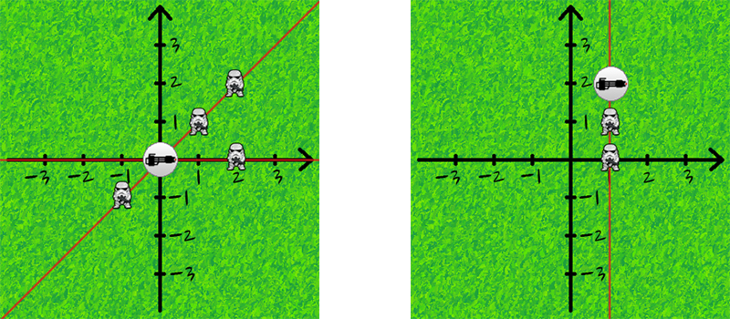

<h1 style='text-align: center;'> B. Han Solo and Lazer Gun</h1>

<h5 style='text-align: center;'>time limit per test: 1 second</h5>
<h5 style='text-align: center;'>memory limit per test: 256 megabytes</h5>

There are *n* Imperial stormtroopers on the field. The battle field is a plane with Cartesian coordinate system. Each stormtrooper is associated with his coordinates (*x*, *y*) on this plane. 

Han Solo has the newest duplex lazer gun to fight these stormtroopers. It is situated at the point (*x*0, *y*0). In one shot it can can destroy all the stormtroopers, situated on some line that crosses point (*x*0, *y*0).

Your task is to determine what minimum number of shots Han Solo needs to defeat all the stormtroopers.

The gun is the newest invention, it shoots very quickly and even after a very large number of shots the stormtroopers don't have enough time to realize what's happening and change their location. 

## Input

The first line contains three integers *n*, *x*0 и *y*0 (1 ≤ *n* ≤ 1000,  - 104 ≤ *x*0, *y*0 ≤ 104) — the number of stormtroopers on the battle field and the coordinates of your gun.

Next *n* lines contain two integers each *x**i*, *y**i* ( - 104 ≤ *x**i*, *y**i* ≤ 104) — the coordinates of the stormtroopers on the battlefield. It is guaranteed that no stormtrooper stands at the same point with the gun. Multiple stormtroopers can stand at the same point.

## Output

Print a single integer — the minimum number of shots Han Solo needs to destroy all the stormtroopers. 

## Examples

## Input


```
4 0 0  
1 1  
2 2  
2 0  
-1 -1  

```
## Output


```
2  

```
## Input


```
2 1 2  
1 1  
1 0  

```
## Output


```
1  

```
## Note

Explanation to the first and second samples from the statement, respectively: 

  

#### tags 

#1400 #brute_force #data_structures #geometry #implementation #math 