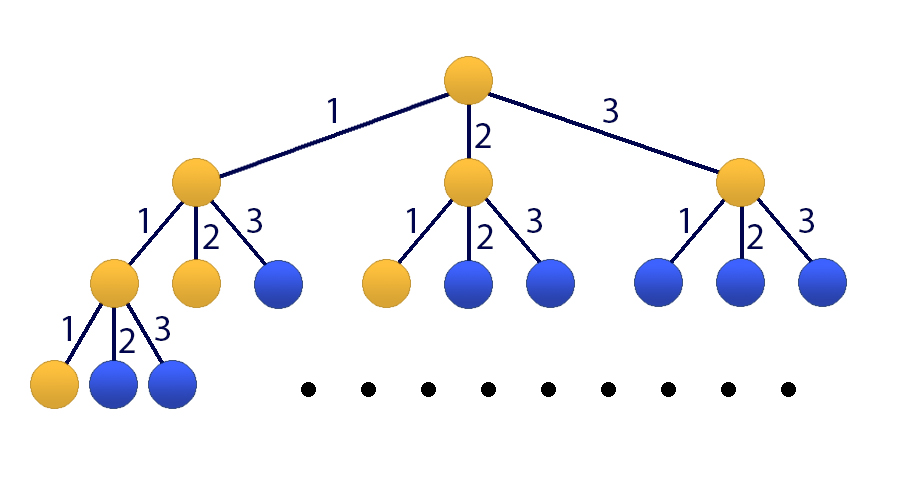

<h1 style='text-align: center;'> E. Darth Vader and Tree</h1>

<h5 style='text-align: center;'>time limit per test: 2 seconds</h5>
<h5 style='text-align: center;'>memory limit per test: 256 megabytes</h5>

When Darth Vader gets bored, he sits down on the sofa, closes his eyes and thinks of an infinite rooted tree where each node has exactly *n* sons, at that for each node, the distance between it an its *i*-th left child equals to *d**i*. The Sith Lord loves counting the number of nodes in the tree that are at a distance at most *x* from the root. The distance is the sum of the lengths of edges on the path between nodes.

But he has got used to this activity and even grew bored of it. 'Why does he do that, then?' — you may ask. It's just that he feels superior knowing that only he can solve this problem. 

Do you want to challenge Darth Vader himself? Count the required number of nodes. As the answer can be rather large, find it modulo 109 + 7.

## Input

The first line contains two space-separated integers *n* and *x* (1 ≤ *n* ≤ 105, 0 ≤ *x* ≤ 109) — the number of children of each node and the distance from the root within the range of which you need to count the nodes.

The next line contains *n* space-separated integers *d**i* (1 ≤ *d**i* ≤ 100) — the length of the edge that connects each node with its *i*-th child.

## Output

Print a single number — the number of vertexes in the tree at distance from the root equal to at most *x*. 

## Examples

## Input


```
3 3  
1 2 3  

```
## Output


```
8  

```
## Note

Pictures to the sample (the yellow color marks the nodes the distance to which is at most three)

   

#### tags 

#2200 #dp #matrices 