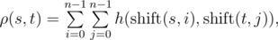
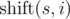
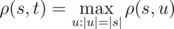

<h1 style='text-align: center;'> C. DNA Alignment</h1>

<h5 style='text-align: center;'>time limit per test: 2 seconds</h5>
<h5 style='text-align: center;'>memory limit per test: 256 megabytes</h5>

Vasya became interested in bioinformatics. He's going to write an article about similar cyclic DNA sequences, so he invented a new method for determining the similarity of cyclic sequences.

Let's assume that strings *s* and *t* have the same length *n*, then the function *h*(*s*, *t*) is defined as the number of positions in which the respective symbols of *s* and *t* are the same. Function *h*(*s*, *t*) can be used to define the function of Vasya distance ρ(*s*, *t*): 

 where  is obtained from string *s*, by applying left circular shift *i* times. For example, ρ("*AGC*", "*CGT*") =  *h*("*AGC*", "*CGT*") + *h*("*AGC*", "*GTC*") + *h*("*AGC*", "*TCG*") +  *h*("*GCA*", "*CGT*") + *h*("*GCA*", "*GTC*") + *h*("*GCA*", "*TCG*") +  *h*("*CAG*", "*CGT*") + *h*("*CAG*", "*GTC*") + *h*("*CAG*", "*TCG*") =  1 + 1 + 0 + 0 + 1 + 1 + 1 + 0 + 1 = 6Vasya found a string *s* of length *n* on the Internet. Now he wants to count how many strings *t* there are such that the Vasya distance from the string *s* attains maximum possible value. Formally speaking, *t* must satisfy the equation: .

Vasya could not try all possible strings to find an answer, so he needs your help. As the answer may be very large, count the number of such strings modulo 109 + 7.

## Input

The first line of the input contains a single integer *n* (1 ≤ *n* ≤ 105).

The second line of the input contains a single string of length *n*, consisting of characters "ACGT".

## Output

Print a single number — the answer modulo 109 + 7.

## Examples

## Input


```
1  
C  

```
## Output


```
1  

```
## Input


```
2  
AG  

```
## Output


```
4  

```
## Input


```
3  
TTT  

```
## Output


```
1  

```
## Note

Please note that if for two distinct strings *t*1 and *t*2 values ρ(*s*, *t*1) и ρ(*s*, *t*2) are maximum among all possible *t*, then both strings must be taken into account in the answer even if one of them can be obtained by a circular shift of another one.

In the first sample, there is ρ("*C*", "*C*") = 1, for the remaining strings *t* of length 1 the value of ρ(*s*, *t*) is 0.

In the second sample, ρ("*AG*", "*AG*") = ρ("*AG*", "*GA*") = ρ("*AG*", "*AA*") = ρ("*AG*", "*GG*") = 4.

In the third sample, ρ("*TTT*", "*TTT*") = 27


#### tags 

#1500 #math #strings 