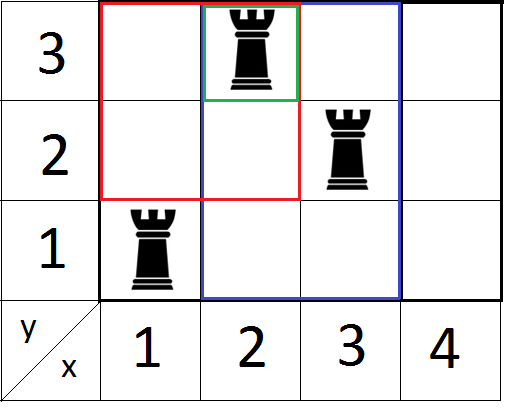

<h1 style='text-align: center;'> E. Rooks and Rectangles</h1>

<h5 style='text-align: center;'>time limit per test: 2 seconds</h5>
<h5 style='text-align: center;'>memory limit per test: 256 megabytes</h5>

Polycarpus has a chessboard of size *n* × *m*, where *k* rooks are placed. Polycarpus hasn't yet invented the rules of the game he will play. However, he has already allocated *q* rectangular areas of special strategic importance on the board, they must be protected well. According to Polycarpus, a rectangular area of ​​the board is well protected if all its vacant squares can be beaten by the rooks that stand on this area. The rooks on the rest of the board do not affect the area's defense. The position of the rooks is fixed and cannot be changed. We remind you that the the rook beats the squares located on the same vertical or horizontal line with it, if there are no other pieces between the square and the rook. Help Polycarpus determine whether all strategically important areas are protected.

## Input

The first line contains four integers *n*, *m*, *k* and *q* (1 ≤ *n*, *m* ≤ 100 000, 1 ≤ *k*, *q* ≤ 200 000) — the sizes of the board, the number of rooks and the number of strategically important sites. We will consider that the cells of the board are numbered by integers from 1 to *n* horizontally and from 1 to *m* vertically. Next *k* lines contain pairs of integers "*x* *y*", describing the positions of the rooks (1 ≤ *x* ≤ *n*, 1 ≤ *y* ≤ *m*). It is guaranteed that all the rooks are in distinct squares. Next *q* lines describe the strategically important areas as groups of four integers "*x*1 *y*1 *x*2 *y*2" (1 ≤ *x*1 ≤ *x*2 ≤ *n*, 1 ≤ *y*1 ≤ *y*2 ≤ *m*). The corresponding rectangle area consists of cells (*x*, *y*), for which *x*1 ≤ *x* ≤ *x*2, *y*1 ≤ *y* ≤ *y*2. Strategically important areas can intersect of coincide.

## Output

Print *q* lines. For each strategically important site print "YES" if it is well defended and "NO" otherwise.

## Examples

## Input


```
4 3 3 3  
1 1  
3 2  
2 3  
2 3 2 3  
2 1 3 3  
1 2 2 3  

```
## Output


```
YES  
YES  
NO  

```
## Note

Picture to the sample:  For the last area the answer is "NO", because cell (1, 2) cannot be hit by a rook.


#### tags 

#2400 #data_structures #sortings 