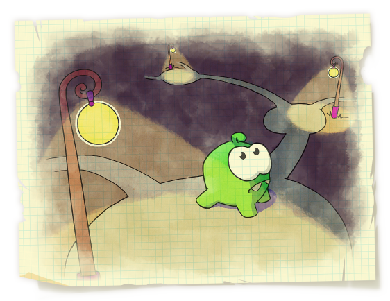
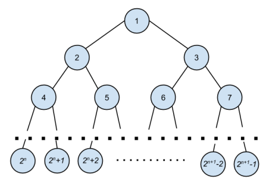
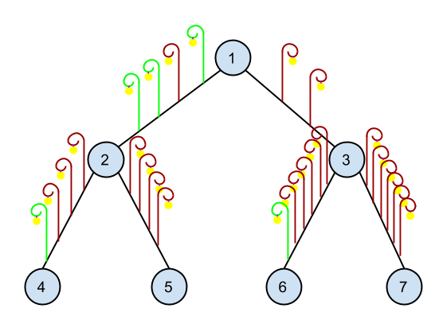

<h1 style='text-align: center;'> B. Om Nom and Dark Park</h1>

<h5 style='text-align: center;'>time limit per test: 1 second</h5>
<h5 style='text-align: center;'>memory limit per test: 256 megabytes</h5>

Om Nom is the main character of a game "Cut the Rope". He is a bright little monster who likes visiting friends living at the other side of the park. However the dark old parks can scare even somebody as fearless as Om Nom, so he asks you to help him.

  The park consists of 2*n* + 1 - 1 squares connected by roads so that the scheme of the park is a full binary tree of depth *n*. More formally, the entrance to the park is located at the square 1. The exits out of the park are located at squares 2*n*, 2*n* + 1, ..., 2*n* + 1 - 1 and these exits lead straight to the Om Nom friends' houses. From each square *i* (2 ≤ *i* < 2*n* + 1) there is a road to the square . Thus, it is possible to go from the park entrance to each of the exits by walking along exactly *n* roads. 

   To light the path roads in the evening, the park keeper installed street lights along each road. The road that leads from square *i* to square  has *a**i* lights.Om Nom loves counting lights on the way to his friend. Om Nom is afraid of spiders who live in the park, so he doesn't like to walk along roads that are not enough lit. What he wants is that the way to any of his friends should have in total the same number of lights. That will make him feel safe. 

He asked you to help him install additional lights. Determine what minimum number of lights it is needed to additionally place on the park roads so that a path from the entrance to any exit of the park contains the same number of street lights. You may add an arbitrary number of street lights to each of the roads.

## Input

The first line contains integer *n* (1 ≤ *n* ≤ 10) — the number of roads on the path from the entrance to any exit.

The next line contains 2*n* + 1 - 2 numbers *a*2, *a*3, ... *a*2*n* + 1 - 1 — the initial numbers of street lights on each road of the park. Here *a**i* is the number of street lights on the road between squares *i* and . All numbers *a**i* are positive integers, not exceeding 100.

## Output

Print the minimum number of street lights that we should add to the roads of the park to make Om Nom feel safe.

## Examples

## Input


```
2  
1 2 3 4 5 6  

```
## Output


```
5  

```
## Note

Picture for the sample test. Green color denotes the additional street lights.

  

#### tags 

#1400 #dfs_and_similar #greedy #implementation 