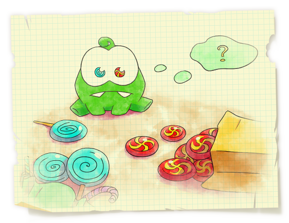

<h1 style='text-align: center;'> C. Om Nom and Candies</h1>

<h5 style='text-align: center;'>time limit per test: 1 second</h5>
<h5 style='text-align: center;'>memory limit per test: 256 megabytes</h5>

A sweet little monster Om Nom loves candies very much. One day he found himself in a rather tricky situation that required him to think a bit in order to enjoy candies the most. Would you succeed with the same task if you were on his place?

  One day, when he came to his friend Evan, Om Nom didn't find him at home but he found two bags with candies. The first was full of blue candies and the second bag was full of red candies. Om Nom knows that each red candy weighs *W**r* grams and each blue candy weighs *W**b* grams. Eating a single red candy gives Om Nom *H**r* joy units and eating a single blue candy gives Om Nom *H**b* joy units.

Candies are the most important thing in the world, but on the other hand overeating is not good. Om Nom knows if he eats more than *C* grams of candies, he will get sick. Om Nom thinks that it isn't proper to leave candy leftovers, so he can only eat a whole candy. Om Nom is a great mathematician and he quickly determined how many candies of what type he should eat in order to get the maximum number of joy units. Can you repeat his achievement? You can assume that each bag contains more candies that Om Nom can eat.

## Input

The single line contains five integers *C*, *H**r*, *H**b*, *W**r*, *W**b* (1 ≤ *C*, *H**r*, *H**b*, *W**r*, *W**b* ≤ 109).

## Output

Print a single integer — the maximum number of joy units that Om Nom can get.

## Examples

## Input


```
10 3 5 2 3  

```
## Output


```
16  

```
## Note

In the sample test Om Nom can eat two candies of each type and thus get 16 joy units.


#### tags 

#2000 #brute_force #greedy #math 