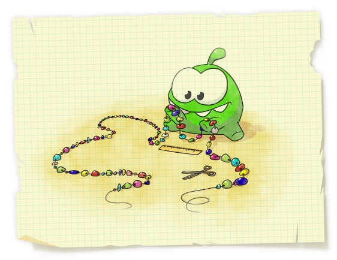

<h1 style='text-align: center;'> D. Om Nom and Necklace</h1>

<h5 style='text-align: center;'>time limit per test: 1 second</h5>
<h5 style='text-align: center;'>memory limit per test: 256 megabytes</h5>

One day Om Nom found a thread with *n* beads of different colors. He decided to cut the first several beads from this thread to make a bead necklace and present it to his girlfriend Om Nelly.

  Om Nom knows that his girlfriend loves beautiful patterns. That's why he wants the beads on the necklace to form a regular pattern. A sequence of beads *S* is regular if it can be represented as *S* = *A* + *B* + *A* + *B* + *A* + ... + *A* + *B* + *A*, where *A* and *B* are some bead sequences, " + " is the concatenation of sequences, there are exactly 2*k* + 1 summands in this sum, among which there are *k* + 1 "*A*" summands and *k* "*B*" summands that follow in alternating order. Om Nelly knows that her friend is an eager mathematician, so she doesn't mind if *A* or *B* is an empty sequence.

Help Om Nom determine in which ways he can cut off the first several beads from the found thread (at least one; probably, all) so that they form a regular pattern. When Om Nom cuts off the beads, he doesn't change their order.

## Input

The first line contains two integers *n*, *k* (1 ≤ *n*, *k* ≤ 1 000 000) — the number of beads on the thread that Om Nom found and number *k* from the definition of the regular sequence above.

The second line contains the sequence of *n* lowercase Latin letters that represent the colors of the beads. Each color corresponds to a single letter.

## Output

Print a string consisting of *n* zeroes and ones. Position *i* (1 ≤ *i* ≤ *n*) must contain either number one if the first *i* beads on the thread form a regular sequence, or a zero otherwise.

## Examples

## Input


```
7 2  
bcabcab  

```
## Output


```
0000011
```
## Input


```
21 2  
ababaababaababaababaa  

```
## Output


```
000110000111111000011
```
## Note

In the first sample test a regular sequence is both a sequence of the first 6 beads (we can take *A* = "", *B* = "bca"), and a sequence of the first 7 beads (we can take *A* = "b", *B* = "ca").

In the second sample test, for example, a sequence of the first 13 beads is regular, if we take *A* = "aba", *B* = "ba".


#### tags 

#2200 #hashing #string_suffix_structures #strings 