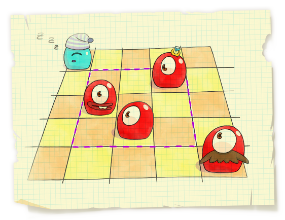

<h1 style='text-align: center;'> F. Pudding Monsters</h1>

<h5 style='text-align: center;'>time limit per test: 2 seconds</h5>
<h5 style='text-align: center;'>memory limit per test: 256 megabytes</h5>

In this problem you will meet the simplified model of game Pudding Monsters.

An important process in developing any game is creating levels. A game field in Pudding Monsters is an *n* × *n* rectangular grid, *n* of its cells contain monsters and some other cells contain game objects. The gameplay is about moving the monsters around the field. When two monsters are touching each other, they glue together into a single big one (as they are from pudding, remember?).

  Statistics showed that the most interesting maps appear if initially each row and each column contains exactly one monster and the rest of map specifics is set up by the correct positioning of the other game objects. 

A technique that's widely used to make the development process more efficient is reusing the available resources. For example, if there is a large *n* × *n* map, you can choose in it a smaller *k* × *k* square part, containing exactly *k* monsters and suggest it as a simplified version of the original map.

You wonder how many ways there are to choose in the initial map a *k* × *k* (1 ≤ *k* ≤ *n*) square fragment, containing exactly *k* pudding monsters. Calculate this number.

## Input

The first line contains a single integer *n* (1 ≤ *n* ≤ 3 × 105) — the size of the initial field.

Next *n* lines contain the coordinates of the cells initially containing monsters. The *i*-th of the next lines contains two numbers *r**i*, *c**i* (1 ≤ *r**i*, *c**i* ≤ *n*) — the row number and the column number of the cell that initially contains the *i*-th monster.

It is guaranteed that all *r**i* are distinct numbers and all *c**i* are distinct numbers.

## Output

Print the number of distinct square fragments of the original field that can form a new map.

## Examples

## Input


```
5  
1 1  
4 3  
3 2  
2 4  
5 5  

```
## Output


```
10  

```


#### tags 

#3000 #data_structures #divide_and_conquer 