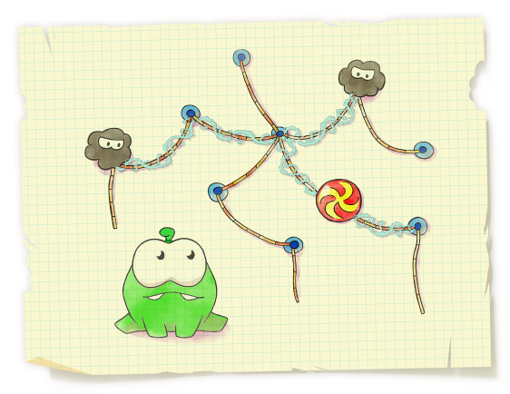

<h1 style='text-align: center;'> G. Spiders Evil Plan</h1>

<h5 style='text-align: center;'>time limit per test: 1 second</h5>
<h5 style='text-align: center;'>memory limit per test: 256 megabytes</h5>

Spiders are Om Nom's old enemies. They love eating candies as much as he does and that's why they keep trying to keep the monster away from his favorite candies. They came up with an evil plan to trap Om Nom.

  Let's consider a rope structure consisting of *n* nodes and *n* - 1 ropes connecting the nodes. The structure is connected, thus, the ropes and the nodes form a tree. Each rope of the formed structure is associated with its length. A candy is tied to node *x* of the structure. Om Nom really wants to eat this candy.

The *y* spiders are trying to stop him from doing it. They decided to entangle the candy and some part of the structure into a web, thus attaching the candy to as large as possible part of the rope structure. 

Each spider can use his web to cover all ropes on the path between two arbitrary nodes *a* and *b*. Thus, *y* spiders can cover the set of ropes which is a union of *y* paths in the given tree. These *y* paths can arbitrarily intersect each other. The spiders want the following conditions to be hold:

* the node containing the candy is adjacent to at least one rope covered with a web
* the ropes covered with the web form a connected structure (what's the idea of covering with a web the ropes that are not connected with the candy?)
* the total length of the ropes covered with web is as large as possible

The spiders haven't yet decided to what node of the structure they will tie the candy and how many spiders will cover the structure with web, so they asked you to help them. Help them calculate the optimal plan for multiple values of *x* and *y*.

## Input

The first line contains numbers *n* and *q* (1 ≤ *n*, *q* ≤ 105) — the number of nodes in the structure and the number of questions that the spiders want to ask you.

The next *n* - 1 lines determine the rope structure. The *i*-th line contains three integers *u**i*, *v**i*, *l**i* (1 ≤ *u**i*, *v**i* ≤ *n*, *u**i* ≠ *v**i*, 1 ≤ *l**i* ≤ 1000), showing that there is a rope of length *l**i* between nodes *u**i* and *v**i*.

Next *q* lines describe the spiders' questions. As they want you to answer their question online, they encoded their messages in a special manner.

Each of the next *q* lines contains two numbers *x**i*, *y**i*. In the first question of the spiders *x* = *x*1, *y* = *y*1.

To calculate values *x* and *y* in the spiders' *i*-th (2 ≤ *i* ≤ *q*) question, you need to use the following formulas:


where *Ans**i* - 1 is the total length of the ropes covered by a web in the answer for the (*i* - 1)-th question.

The following inequality holds: 1 ≤ *x**i*, *y**i* ≤ *n*.

## Output

For each question of the spiders print on a separate line a single integer *Ans**i* — the total length of the ropes covered with web in the optimal plan.

## Examples

## Input


```
6 3  
1 2 2  
2 3 2  
3 4 2  
4 6 1  
3 5 10  
3 1  
2 5  
1 1  

```
## Output


```
14  
13  
17  

```


#### tags 

#3300 #greedy #trees 