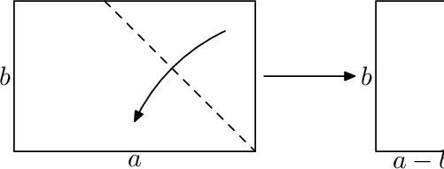
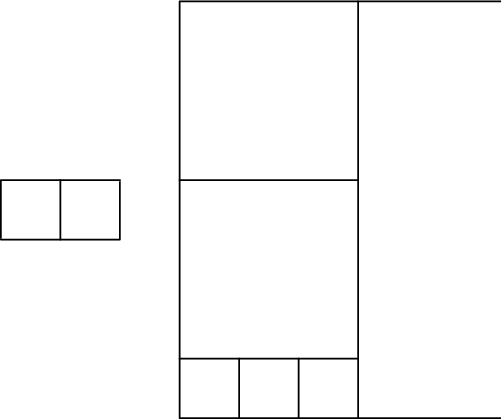

<h1 style='text-align: center;'> A. Playing with Paper</h1>

<h5 style='text-align: center;'>time limit per test: 2 seconds</h5>
<h5 style='text-align: center;'>memory limit per test: 256 megabytes</h5>

One day Vasya was sitting on a not so interesting Maths lesson and making an origami from a rectangular *a* mm  ×  *b* mm sheet of paper (*a* > *b*). Usually the first step in making an origami is making a square piece of paper from the rectangular sheet by folding the sheet along the bisector of the right angle, and cutting the excess part.

  After making a paper ship from the square piece, Vasya looked on the remaining (*a* - *b*) mm  ×  *b* mm strip of paper. He got the idea to use this strip of paper in the same way to make an origami, and then use the remainder (if it exists) and so on. At the moment when he is left with a square piece of paper, he will make the last ship from it and stop.

Can you determine how many ships Vasya will make during the lesson?

## Input

The first line of the input contains two integers *a*, *b* (1 ≤ *b* < *a* ≤ 1012) — the sizes of the original sheet of paper.

## Output

Print a single integer — the number of ships that Vasya will make.

## Examples

## Input


```
2 1  

```
## Output


```
2  

```
## Input


```
10 7  

```
## Output


```
6  

```
## Input


```
1000000000000 1  

```
## Output


```
1000000000000  

```
## Note

Pictures to the first and second sample test.

  

#### tags 

#1100 #implementation #math 