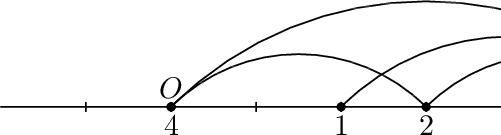

<h1 style='text-align: center;'> D. Clique Problem</h1>

<h5 style='text-align: center;'>time limit per test: 2 seconds</h5>
<h5 style='text-align: center;'>memory limit per test: 256 megabytes</h5>

The clique problem is one of the most well-known NP-complete problems. Under some simplification it can be formulated as follows. Consider an undirected graph *G*. It is required to find a subset of vertices *C* of the maximum size such that any two of them are connected by an edge in graph *G*. Sounds simple, doesn't it? Nobody yet knows an algorithm that finds a solution to this problem in polynomial time of the size of the graph. However, as with many other NP-complete problems, the clique problem is easier if you consider a specific type of a graph.

Consider *n* distinct points on a line. Let the *i*-th point have the coordinate *x**i* and weight *w**i*. Let's form graph *G*, whose vertices are these points and edges connect exactly the pairs of points (*i*, *j*), such that the distance between them is not less than the sum of their weights, or more formally: |*x**i* - *x**j*| ≥ *w**i* + *w**j*.

Find the size of the maximum clique in such graph.

## Input

The first line contains the integer *n* (1 ≤ *n* ≤ 200 000) — the number of points.

Each of the next *n* lines contains two numbers *x**i*, *w**i* (0 ≤ *x**i* ≤ 109, 1 ≤ *w**i* ≤ 109) — the coordinate and the weight of a point. All *x**i* are different.

## Output

Print a single number — the number of vertexes in the maximum clique of the given graph.

## Examples

## Input


```
4  
2 3  
3 1  
6 1  
0 2  

```
## Output


```
3  

```
## Note

If you happen to know how to solve this problem without using the specific properties of the graph formulated in the problem statement, then you are able to get a prize of one million dollars!

The picture for the sample test.

  

#### tags 

#1800 #data_structures #dp #greedy #implementation #sortings 