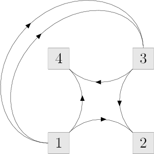
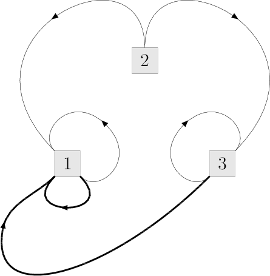
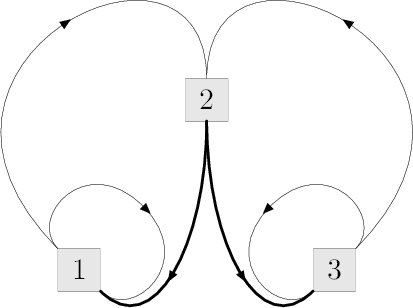

<h1 style='text-align: center;'> E. Data Center Drama</h1>

<h5 style='text-align: center;'>time limit per test: 2 seconds</h5>
<h5 style='text-align: center;'>memory limit per test: 256 megabytes</h5>

The project of a data center of a Big Software Company consists of *n* computers connected by *m* cables. Simply speaking, each computer can be considered as a box with multiple cables going out of the box. Very Important Information is transmitted along each cable in one of the two directions. As the data center plan is not yet approved, it wasn't determined yet in which direction information will go along each cable. The cables are put so that each computer is connected with each one, perhaps through some other computers.

The person in charge of the cleaning the data center will be Claudia Ivanova, the janitor. She loves to tie cables into bundles using cable ties. For some reasons, she groups the cables sticking out of a computer into groups of two, and if it isn't possible, then she gets furious and attacks the computer with the water from the bucket.

It should also be noted that due to the specific physical characteristics of the Very Important Information, it is strictly forbidden to connect in one bundle two cables where information flows in different directions.

The management of the data center wants to determine how to send information along each cable so that Claudia Ivanova is able to group all the cables coming out of each computer into groups of two, observing the condition above. Since it may not be possible with the existing connections plan, you are allowed to add the minimum possible number of cables to the scheme, and then you need to determine the direction of the information flow for each cable (yes, sometimes data centers are designed based on the janitors' convenience...)

## Input

The first line contains two numbers, *n* and *m* (1 ≤ *n* ≤ 100 000, 1 ≤ *m* ≤ 200 000) — the number of computers and the number of the already present cables, respectively.

Each of the next lines contains two numbers *a**i*, *b**i* (1 ≤ *a**i*, *b**i* ≤ *n*) — the indices of the computers connected by the *i*-th cable. The data centers often have a very complex structure, so a pair of computers may have more than one pair of cables between them and some cables may connect a computer with itself.

## Output

In the first line print a single number *p* (*p* ≥ *m*) — the minimum number of cables in the final scheme.

In each of the next *p* lines print a pair of numbers *c**i*, *d**i* (1 ≤ *c**i*, *d**i* ≤ *n*), describing another cable. Such entry means that information will go along a certain cable in direction from *c**i* to *d**i*.

Among the cables you printed there should be all the cables presented in the original plan in some of two possible directions. It is guaranteed that there is a solution where *p* doesn't exceed 500 000.

If there are several posible solutions with minimum possible value of *p*, print any of them.

## Examples

## Input


```
4 6  
1 2  
2 3  
3 4  
4 1  
1 3  
1 3  

```
## Output


```
6  
1 2  
3 4  
1 4  
3 2  
1 3  
1 3
```
## Input


```
3 4  
1 2  
2 3  
1 1  
3 3  

```
## Output


```
6  
2 1  
2 3  
1 1  
3 3  
3 1  
1 1  

```
## Note

Picture for the first sample test. The tied pairs of cables are shown going out from the same point.

  Picture for the second test from the statement. The added cables are drawin in bold.

  Alternative answer for the second sample test:

  

#### tags 

#2600 #dfs_and_similar #graphs 