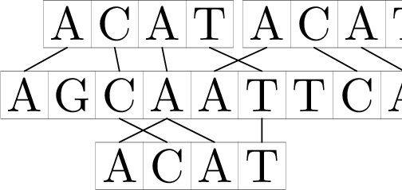

<h1 style='text-align: center;'> D. Fuzzy Search</h1>

<h5 style='text-align: center;'>time limit per test: 3 seconds</h5>
<h5 style='text-align: center;'>memory limit per test: 256 megabytes</h5>

Leonid works for a small and promising start-up that works on decoding the human genome. His duties include solving complex problems of finding certain patterns in long strings consisting of letters 'A', 'T', 'G' and 'C'.

Let's consider the following scenario. There is a fragment of a human DNA chain, recorded as a string *S*. To analyze the fragment, you need to find all occurrences of string *T* in a string *S*. However, the matter is complicated by the fact that the original chain fragment could contain minor mutations, which, however, complicate the task of finding a fragment. Leonid proposed the following approach to solve this problem.

Let's write down integer *k* ≥ 0 — the error threshold. We will say that string *T* occurs in string *S* on position *i* (1 ≤ *i* ≤ |*S*| - |*T*| + 1), if after putting string *T* along with this position, each character of string *T* corresponds to the some character of the same value in string *S* at the distance of at most *k*. More formally, for any *j* (1 ≤ *j* ≤ |*T*|) there must exist such *p* (1 ≤ *p* ≤ |*S*|), that |(*i* + *j* - 1) - *p*| ≤ *k* and *S*[*p*] = *T*[*j*].

For example, corresponding to the given definition, string "ACAT" occurs in string "AGCAATTCAT" in positions 2, 3 and 6.

  ## Note

 that at *k* = 0 the given definition transforms to a simple definition of the occurrence of a string in a string.

Help Leonid by calculating in how many positions the given string *T* occurs in the given string *S* with the given error threshold.

## Input

The first line contains three integers |*S*|, |*T*|, *k* (1 ≤ |*T*| ≤ |*S*| ≤ 200 000, 0 ≤ *k* ≤ 200 000) — the lengths of strings *S* and *T* and the error threshold.

The second line contains string *S*.

The third line contains string *T*.

Both strings consist only of uppercase letters 'A', 'T', 'G' and 'C'.

## Output

Print a single number — the number of occurrences of *T* in *S* with the error threshold *k* by the given definition.

## Examples

## Input


```
10 4 1  
AGCAATTCAT  
ACAT  

```
## Output


```
3  

```
## Note

If you happen to know about the structure of the human genome a little more than the author of the problem, and you are not impressed with Leonid's original approach, do not take everything described above seriously.


#### tags 

#2500 #bitmasks #brute_force #fft 