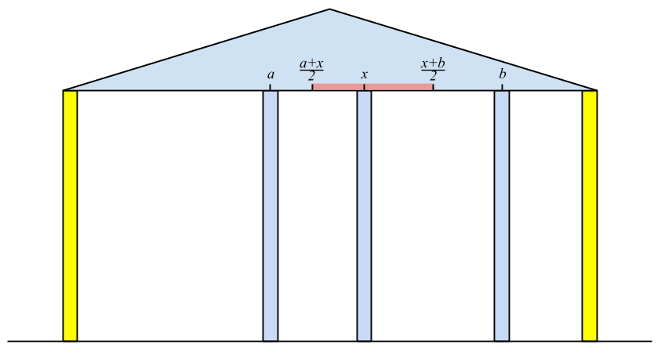

<h1 style='text-align: center;'> D. Landmarks</h1>

<h5 style='text-align: center;'>time limit per test: 2 seconds</h5>
<h5 style='text-align: center;'>memory limit per test: 256 megabytes</h5>

We have an old building with *n* + 2 columns in a row. These columns support the ceiling. These columns are located in points with coordinates 0 = *x*0 < *x*1 < ... < *x**n* < *x**n* + 1. The leftmost and the rightmost columns are special, we will call them bearing, the other columns are ordinary. 

For each column we know its durability *d**i*. Let's consider an ordinary column with coordinate *x*. Let's assume that the coordinate of the closest to it column to the left (bearing or ordinary) is *a* and the coordinate of the closest to it column to the right (also, bearing or ordinary) is *b*. In this task let's assume that this column supports the segment of the ceiling from point  to point  (here both fractions are considered as real division). If the length of the segment of the ceiling supported by the column exceeds *d**i*, then the column cannot support it and it crashes after a while, and after that the load is being redistributeed between the neighbouring columns according to the same principle.

  Thus, ordinary columns will be crashing for some time until the process stops at some state. One can prove that the set of the remaining columns doesn't depend on the order in which columns crash. If there are only two bearing columns left in the end, then we assume that the whole construction crashes under the weight of the roof. But if at least one ordinary column stays in addition to the bearing ones, then the building doesn't crash.

To make the building stronger, we can add one extra ordinary column of arbitrary durability *d*' at any (not necessarily integer) point 0 < *x*' < *x**n* + 1. If point *x*' is already occupied by an ordinary column, it is replaced by a new one.

Your task is to find out: what minimal durability can the added column have so that the building doesn't crash?

## Input

The first line contains integer *n* (1 ≤ *n* ≤ 105) — the number of ordinary columns.

The second line contains *n* + 2 integers *x*0, *x*1, ..., *x**n*, *x**n* + 1 (*x*0 = 0, *x**i* < *x**i* + 1 for 0 ≤ *i* ≤ *n*, *x**n* + 1 ≤ 109) — the coordinates of the columns.

The third line contains *n* integers *d*1, *d*2, ..., *d**n* (1 ≤ *d**i* ≤ 109).

## Output

Print a single number — the minimum possible durability of the column that you need to add in order to make the building stay. If you do not have to add the column, please print 0. Your answer will be checked with the relative or absolute error 10- 4.

## Examples

## Input


```
2  
0 20 40 100  
15 40  

```
## Output


```
10  

```
## Input


```
3  
0 4 10 28 30  
9 13 5  

```
## Output


```
0  

```


#### tags 

#3000 #data_structures #dp 