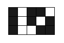

<h1 style='text-align: center;'> F. Simplified Nonogram</h1>

<h5 style='text-align: center;'>time limit per test: 2 seconds</h5>
<h5 style='text-align: center;'>memory limit per test: 256 megabytes</h5>

In this task you have to write a program dealing with nonograms on fields no larger than 5 × 20.

Simplified nonogram is a task where you have to build such field (each cell is either white or black) that satisfies the given information about rows and columns. For each row and each column the number of contiguous black segments is specified. 

For example if size of the field is *n* = 3, *m* = 5, аnd numbers of contiguous black segments in rows are: [2, 3, 2] and in columns are: [1, 0, 1, 2, 1] then the solution may look like:

  It is guaranteed that on each test in the testset there exists at least one solution.

## Input

In the first line there follow two integers *n*, *m* (1 ≤ *n* ≤ 5, 1 ≤ *m* ≤ 20) — number of rows and number of columns respectively.

Second line contains *n* integers *a*1, *a*2, ..., *a**n* where *a**i* is the number of contiguous black segments in *i*-th row of the field. 

Similarly, third line contains *m* integers *b*1, *b*2, ..., *b**m* where *b**i* is the number of contiguous black segments in the *i*-th column of the field.

It is guaranteed that there exists at least one solution.

## Output

## Output

 any possible solution. ## Output

 should consist of *n* lines each containing *m* characters. Denote white cell as "." and black cell as "*".

## Examples

## Input


```
3 5  
2 3 2  
1 0 1 2 1  

```
## Output


```
*.**.  
*.*.*  
*..**
```
## Input


```
3 3  
2 1 2  
2 1 2  

```
## Output


```
*.*  
.*.  
*.*  

```
## Input


```
3 3  
1 0 1  
2 2 2  

```
## Output


```
***  
...  
***  

```


#### tags 

#2400 #bitmasks #dp #hashing #meet-in-the-middle 