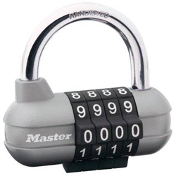

<h1 style='text-align: center;'> A. Combination Lock</h1>

<h5 style='text-align: center;'>time limit per test: 2 seconds</h5>
<h5 style='text-align: center;'>memory limit per test: 256 megabytes</h5>

Scrooge McDuck keeps his most treasured savings in a home safe with a combination lock. Each time he wants to put there the treasures that he's earned fair and square, he has to open the lock.

  The combination lock is represented by *n* rotating disks with digits from 0 to 9 written on them. Scrooge McDuck has to turn some disks so that the combination of digits on the disks forms a secret combination. In one move, he can rotate one disk one digit forwards or backwards. In particular, in one move he can go from digit 0 to digit 9 and vice versa. What minimum number of actions does he need for that?

## Input

The first line contains a single integer *n* (1 ≤ *n* ≤ 1000) — the number of disks on the combination lock.

The second line contains a string of *n* digits — the original state of the disks.

The third line contains a string of *n* digits — Scrooge McDuck's combination that opens the lock.

## Output

Print a single integer — the minimum number of moves Scrooge McDuck needs to open the lock.

## Examples

## Input


```
5  
82195  
64723  

```
## Output


```
13  

```
## Note

In the sample he needs 13 moves:

* 1 disk: 
* 2 disk: 
* 3 disk: 
* 4 disk: 
* 5 disk: 


#### tags 

#800 #implementation 