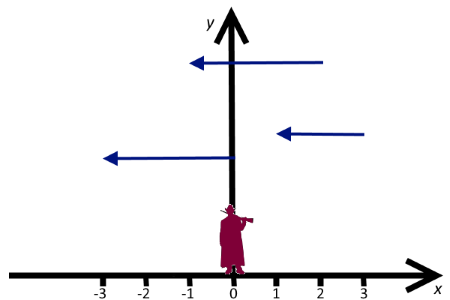

<h1 style='text-align: center;'> B. Duck Hunt</h1>

<h5 style='text-align: center;'>time limit per test: 3 seconds</h5>
<h5 style='text-align: center;'>memory limit per test: 256 megabytes</h5>

A duck hunter is doing his favorite thing, hunting. He lives in a two dimensional world and is located at point (0, 0). As he doesn't like walking for his prey, he prefers to shoot only vertically up (because in this case, the ducks fall straight into his hands). The hunter doesn't reload the gun immediately — *r* or more seconds must pass between the shots. When the hunter shoots up, the bullet immediately hits all the ducks who are directly above the hunter.

In a two dimensional world each duck is a horizontal segment that moves horizontally in the negative direction of the *Ox* axis at the speed 1 length unit per second. For each duck we know the values *h**i* and *t**i* — the *x*-coordinates of its head (the left end of the segment) and its tail (the right end of the segment) at time 0. The height where the duck is flying isn't important as the gun shoots vertically up to the infinite height and hits all the ducks on its way. 

  The figure to the first sample. What maximum number of ducks can the hunter shoot? The duck is considered shot by the hunter if at the moment of the shot at least one of its point intersects the *Oy* axis. After the hunter shoots the duck, it falls and it can't be shot anymore. The hunter cannot make shots before the moment of time 0.

## Input

The first line of the input contains integers *n*, *r* (1 ≤ *n* ≤ 200 000, 1 ≤ *r* ≤ 109) — the number of ducks and the minimum time in seconds between the shots. 

Then *n* lines follow, each of them contains two integers *h**i*, *t**i* ( - 109 ≤ *h**i* < *t**i* ≤ 109) — the *x*-coordinate of the head and tail of the *i*-th duck at the moment 0.

## Output

Print a single integer — the maximum number of ducks that can be shot by the hunter.

## Examples

## Input


```
3 3  
-3 0  
1 3  
-1 2  

```
## Output


```
3  

```
## Input


```
4 5  
-1 1  
2 4  
5 9  
6 8  

```
## Output


```
3  

```
## Note

In the first sample the hunter must shoot at time 0, this shot kills ducks 1 and 3. Then the hunter needs to reload the gun and shoot again at time 3. His second shot hits the tail of duck 2.

In the second sample the hunter can make shots at times 0 and 6 to hit three ducks.


#### tags 

#3100 #data_structures 