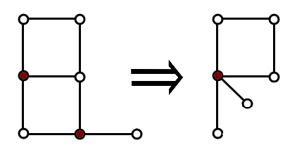

<h1 style='text-align: center;'> E. Playing on Graph</h1>

<h5 style='text-align: center;'>time limit per test: 3 seconds</h5>
<h5 style='text-align: center;'>memory limit per test: 256 megabytes</h5>

Vova and Marina love offering puzzles to each other. Today Marina offered Vova to cope with the following task.

Vova has a non-directed graph consisting of *n* vertices and *m* edges without loops and multiple edges. Let's define the operation of contraction two vertices *a* and *b* that are not connected by an edge. As a result of this operation vertices *a* and *b* are deleted and instead of them a new vertex *x* is added into the graph, and also edges are drawn from it to all vertices that were connected with *a* or with *b* (specifically, if the vertex was connected with both *a* and *b*, then also exactly one edge is added from *x* to it). Thus, as a result of contraction again a non-directed graph is formed, it contains no loops nor multiple edges, and it contains (*n* - 1) vertices.

Vova must perform the contraction an arbitrary number of times to transform the given graph into a chain of the maximum length. A chain of length *k* (*k* ≥ 0) is a connected graph whose vertices can be numbered with integers from 1 to *k* + 1 so that the edges of the graph connect all pairs of vertices (*i*, *i* + 1) (1 ≤ *i* ≤ *k*) and only them. Specifically, the graph that consists of one vertex is a chain of length 0. The vertices that are formed as a result of the contraction are allowed to be used in the following operations of contraction.

  The picture illustrates the contraction of two vertices marked by red. Help Vova cope with his girlfriend's task. Find the maximum length of the chain that can be obtained from the resulting graph or else determine that it is impossible to obtain the chain.

## Input

The first line contains two integers *n*, *m* (1 ≤ *n* ≤ 1000, 0 ≤ *m* ≤ 100 000) — the number of vertices and the number of edges in the original graph.

Next *m* lines contain the descriptions of edges in the format *a**i*, *b**i* (1 ≤ *a**i*, *b**i* ≤ *n*, *a**i* ≠ *b**i*), which means that there is an edge between vertices *a**i* and *b**i*. It is guaranteed that there is at most one edge between each pair of vertexes.

## Output

If it is impossible to obtain a chain from the given graph, print  - 1. Otherwise, print the maximum possible number of edges in the resulting chain.

## Examples

## Input


```
5 4  
1 2  
2 3  
3 4  
3 5  

```
## Output


```
3  

```
## Input


```
4 6  
1 2  
2 3  
1 3  
3 4  
2 4  
1 4  

```
## Output


```
-1  

```
## Input


```
4 2  
1 3  
2 4  

```
## Output


```
2  

```
## Note

In the first sample test you can contract vertices 4 and 5 and obtain a chain of length 3.

In the second sample test it is initially impossible to contract any pair of vertexes, so it is impossible to achieve the desired result.

In the third sample test you can contract vertices 1 and 2 and obtain a chain of length 2.


#### tags 

#2600 #graphs #shortest_paths 