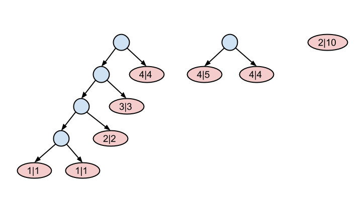

<h1 style='text-align: center;'> F. Quest</h1>

<h5 style='text-align: center;'>time limit per test: 1 second</h5>
<h5 style='text-align: center;'>memory limit per test: 256 megabytes</h5>

Polycarp is making a quest for his friends. He has already made *n* tasks, for each task the boy evaluated how interesting it is as an integer *q**i*, and the time *t**i* in minutes needed to complete the task. 

An interesting feature of his quest is: each participant should get the task that is best suited for him, depending on his preferences. The task is chosen based on an interactive quiz that consists of some questions. The player should answer these questions with "yes" or "no". Depending on the answer to the question, the participant either moves to another question or goes to one of the tasks that are in the quest. In other words, the quest is a binary tree, its nodes contain questions and its leaves contain tasks. 

We know that answering any of the questions that are asked before getting a task takes exactly one minute from the quest player. Polycarp knows that his friends are busy people and they can't participate in the quest for more than *T* minutes. Polycarp wants to choose some of the *n* tasks he made, invent the corresponding set of questions for them and use them to form an interactive quiz as a binary tree so that no matter how the player answers quiz questions, he spends at most *T* minutes on completing the whole quest (that is, answering all the questions and completing the task). Specifically, the quest can contain zero questions and go straight to the task. Each task can only be used once (i.e., the people who give different answers to questions should get different tasks).

Polycarp wants the total "interest" value of the tasks involved in the quest to be as large as possible. Help him determine the maximum possible total interest value of the task considering that the quest should be completed in *T* minutes at any variant of answering questions.

## Input

The first line contains two integers *n* and *T* (1 ≤ *n* ≤ 1000, 1 ≤ *T* ≤ 100) — the number of tasks made by Polycarp and the maximum time a quest player should fit into.

Next *n* lines contain two integers *t**i*, *q**i* (1 ≤ *t**i* ≤ *T*, 1 ≤ *q**i* ≤ 1000) each — the time in minutes needed to complete the *i*-th task and its interest value.

## Output

Print a single integer — the maximum possible total interest value of all the tasks in the quest.

## Examples

## Input


```
5 5  
1 1  
1 1  
2 2  
3 3  
4 4  

```
## Output


```
11  

```
## Input


```
5 5  
4 1  
4 2  
4 3  
4 4  
4 5  

```
## Output


```
9  

```
## Input


```
2 2  
1 1  
2 10  

```
## Output


```
10  

```
## Note

In the first sample test all the five tasks can be complemented with four questions and joined into one quest.

In the second sample test it is impossible to use all the five tasks, but you can take two of them, the most interesting ones.

In the third sample test the optimal strategy is to include only the second task into the quest.

Here is the picture that illustrates the answers to the sample tests. The blue circles represent the questions, the two arrows that go from every circle represent where a person goes depending on his answer to that question. The tasks are the red ovals.

  

#### tags 

#2100 #dp #greedy 