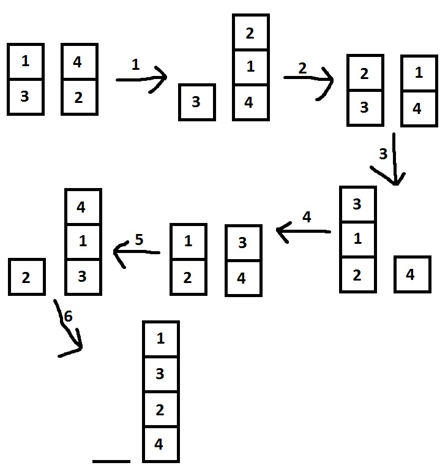
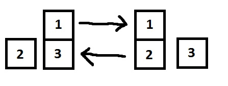

<h1 style='text-align: center;'> C. Soldier and Cards</h1>

<h5 style='text-align: center;'>time limit per test: 2 seconds</h5>
<h5 style='text-align: center;'>memory limit per test: 256 megabytes</h5>

Two bored soldiers are playing card war. Their card deck consists of exactly *n* cards, numbered from 1 to *n*, all values are different. They divide cards between them in some manner, it's possible that they have different number of cards. Then they play a "war"-like card game. 

The rules are following. On each turn a fight happens. Each of them picks card from the top of his stack and puts on the table. The one whose card value is bigger wins this fight and takes both cards from the table to the bottom of his stack. More precisely, he first takes his opponent's card and puts to the bottom of his stack, and then he puts his card to the bottom of his stack. If after some turn one of the player's stack becomes empty, he loses and the other one wins. 

You have to calculate how many fights will happen and who will win the game, or state that game won't end.

## Input

First line contains a single integer *n* (2 ≤ *n* ≤ 10), the number of cards.

Second line contains integer *k*1 (1 ≤ *k*1 ≤ *n* - 1), the number of the first soldier's cards. Then follow *k*1 integers that are the values on the first soldier's cards, from top to bottom of his stack.

Third line contains integer *k*2 (*k*1 + *k*2 = *n*), the number of the second soldier's cards. Then follow *k*2 integers that are the values on the second soldier's cards, from top to bottom of his stack.

All card values are different.

## Output

If somebody wins in this game, print 2 integers where the first one stands for the number of fights before end of game and the second one is 1 or 2 showing which player has won.

If the game won't end and will continue forever output  - 1.

## Examples

## Input


```
4  
2 1 3  
2 4 2  

```
## Output


```
6 2
```
## Input


```
3  
1 2  
2 1 3  

```
## Output


```
-1
```
## Note

First sample: 

  Second sample: 

  

#### tags 

#1400 #brute_force #dfs_and_similar #games 