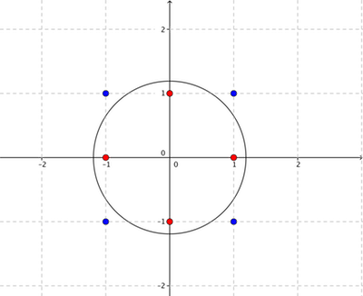

<h1 style='text-align: center;'> E. Sasha Circle</h1>

<h5 style='text-align: center;'>time limit per test: 2 seconds</h5>
<h5 style='text-align: center;'>memory limit per test: 256 megabytes</h5>

Berlanders like to eat cones after a hard day. Misha Square and Sasha Circle are local authorities of Berland. Each of them controls its points of cone trade. Misha has *n* points, Sasha — *m*. Since their subordinates constantly had conflicts with each other, they decided to build a fence in the form of a circle, so that the points of trade of one businessman are strictly inside a circle, and points of the other one are strictly outside. It doesn't matter which of the two gentlemen will have his trade points inside the circle.

Determine whether they can build a fence or not.

## Input

The first line contains two integers *n* and *m* (1 ≤ *n*, *m* ≤ 10000), numbers of Misha's and Sasha's trade points respectively.

The next *n* lines contains pairs of space-separated integers *M**x*, *M**y* ( - 104 ≤ *M**x*, *M**y* ≤ 104), coordinates of Misha's trade points.

The next *m* lines contains pairs of space-separated integers *S**x*, *S**y* ( - 104 ≤ *S**x*, *S**y* ≤ 104), coordinates of Sasha's trade points.

It is guaranteed that all *n* + *m* points are distinct.

## Output

The only output line should contain either word "YES" without quotes in case it is possible to build a such fence or word "NO" in the other case.

## Examples

## Input


```
2 2  
-1 0  
1 0  
0 -1  
0 1  

```
## Output


```
NO  

```
## Input


```
4 4  
1 0  
0 1  
-1 0  
0 -1  
1 1  
-1 1  
-1 -1  
1 -1  

```
## Output


```
YES  

```
## Note

In the first sample there is no possibility to separate points, because any circle that contains both points ( - 1, 0), (1, 0) also contains at least one point from the set (0,  - 1), (0, 1), and vice-versa: any circle that contains both points (0,  - 1), (0, 1) also contains at least one point from the set ( - 1, 0), (1, 0)

In the second sample one of the possible solution is shown below. Misha's points are marked with red colour and Sasha's are marked with blue. 


#### tags 

#2700 #geometry #math 